# DIAGRAMS Review & Optimization Plan

**Purpose:** Align visual diagrams with recent framework developments (strategic docs 08-11, new playbooks, expanded concepts)

**Date:** November 2025  
**Status:** Assessment Complete → Awaiting Approval

---

## Executive Summary

### Current State
- **10 Mermaid diagrams** (.mmd) covering core framework, operational patterns, implementation
- **1 markdown comparison** (bipolar-vs-ai-native.md) - comprehensive text-based visual
- **Last updated:** 2025-11-02 (before strategic docs 08-11 expansion)
- **Quality:** High - well-organized, color-coded, documented

### Identified Gaps
Framework has evolved significantly with new concepts that need visual representation:
1. **4-Level Role Hierarchy** (Doc 10) - No dedicated diagram
2. **AI-Native Agile Sprint Flow** (Doc 11) - No dedicated diagram  
3. **5 Human-AI Collaboration Models** (Doc 08) - Not visualized
4. **Economics of AI-as-Workforce** (Doc 09) - Partially covered in bipolar-vs-ai-native.md

### Recommendation
**Create 3 new diagrams** + **update 2 existing diagrams** to ensure complete framework coverage.

**Estimated Effort:** 3-4 hours  
**Priority:** High (diagrams critical for framework comprehension)

---

## Detailed Assessment

### ✅ Diagrams Working Well (No Changes Needed)

| Diagram | Purpose | Coverage | Status |
|---------|---------|----------|--------|
| **solid-ai-architecture.mmd** | 6-layer framework overview | Complete - shows all layers | ✅ Keep as-is |
| **data-spine-architecture.mmd** | Data Spine detail | Complete - contracts, products, lineage | ✅ Keep as-is |
| **ai-native-safe-model.mmd** | Ethical AI sequence | Complete - safety guardrails | ✅ Keep as-is |
| **sipoc-automation-pattern.mmd** | SIPOC automation | Complete - process automation pattern | ✅ Keep as-is |
| **pool-engagement-patterns.mmd** | Pool engagement models | Complete - embedded/on-demand/self-service | ✅ Keep as-is |
| **squad-lifecycle.mmd** | Squad lifecycle | Complete - inception to dissolution | ✅ Keep as-is |
| **cognitive-decision-flow.mmd** | AI decision-making | Complete - confidence thresholds, escalation | ✅ Keep as-is |
| **midora-implementation.mmd** | Implementation reference | Complete - 4 systems, 10+ repos, 6 pools | ✅ Keep as-is |
| **bipolar-vs-ai-native.md** | Bipolar org comparison | Comprehensive - already includes economics | ✅ Keep as-is |

**Notes:**
- These diagrams are well-designed and cover their scope completely
- No updates needed unless specific enhancement requests arise
- Color scheme consistent (Purpose=Orange, DataSpine=Blue, Cognitive=Purple, etc.)

---

### 🔄 Diagrams Needing Updates (2 Diagrams)

#### 1. **organizational-flow.mmd** - Add Role Hierarchy Levels

**Current State:**
- Shows: Portfolio → Squads → Pools → AI Agents → Governance → Data Spine
- Shows: Triad structure (PO/SA/PM)
- Shows: Flow patterns between components
- **Missing:** 4-level role hierarchy (Low/Intermediate/High/Executive)

**Gap:**
- Doc 10 (Role Hierarchy) defines 4-level framework
- Playbooks reference role levels extensively
- ADOPTION pack has role-hierarchy-matrix.yaml template
- Diagram doesn't show WHERE these levels exist in organizational structure

**Proposed Update:**
Add role level annotations to Pool and Squad nodes:

```mermaid
subgraph Pools["🏊 Capability Pools"]
    DevPool[Multidisciplinary Developers<br/>Levels: Low → Intermediate]
    QAPool[Quality Assurance<br/>Levels: Low → Intermediate]
    ArchPool[Solutions Architecture<br/>Levels: High → Executive]
    PMOPool[PMO<br/>Levels: Intermediate → High]
    CoachPool[Agile Coaching<br/>Levels: High]
    PortPool[Portfolio Strategy<br/>Levels: Executive]
end

subgraph Squad["🎯 Product Triad Squad"]
    PO[Product Owner<br/>Level: High]
    SA[System Architect<br/>Level: High]
    PM[Project Manager<br/>Level: Intermediate]
end
```

**Estimated Effort:** 30 minutes  
**Priority:** P1 (High) - critical for understanding role expectations

---

#### 2. **human-ai-evolution.mmd** - Align with 5 Collaboration Models

**Current State:**
- Shows: Timeline (2025-2027) with % allocation shifts (Human vs. AI)
- Shows: 7 roles (PO, SA, PM, Developers, QA, PMO, Operations)
- Shows: Evolution from human-dominant to AI-dominant

**Gap:**
- Doc 08 (Human-AI Collaboration) defines **5 collaboration models**:
  1. **Human-Led with AI Support** (Strategic decisions)
  2. **Human-AI Partnership** (Co-creation)
  3. **AI-Led with Human Oversight** (Routine tasks)
  4. **AI-Autonomous with Human Curatorship** (High-volume operations)
  5. **Reserved for Humans** (Ethics, leadership, creativity)
- Current diagram shows % allocation but doesn't map to these 5 models
- Doesn't show which tasks fall into which collaboration model per role

**Proposed Update:**
Add a second Gantt chart or transition to flowchart showing:
- **Collaboration model per role** (not just percentages)
- **Task types** within each role mapped to models
- Example:
  ```
  Product Owner:
    - Vision & Strategy → Reserved for Humans
    - Backlog Prioritization → Human-Led with AI Support
    - User Story Generation → Human-AI Partnership
    - Sprint Planning → Human-Led with AI Support
  
  QA Engineer:
    - Test Automation → AI-Led with Human Oversight
    - Exploratory Testing → Human-AI Partnership
    - Production Monitoring → AI-Autonomous with Human Curatorship
  ```

**Alternative (simpler):** Add annotations to existing Gantt chart:
```mermaid
section Product Owner
Human (100%) [Reserved + Human-Led]    :2025-01, 2025-12
Human (60%) AI (40%) [Partnership]     :2026-01, 2027-01
```

**Estimated Effort:** 1 hour  
**Priority:** P2 (Medium) - valuable for understanding collaboration patterns

---

### 🆕 Missing Diagrams (3 New Diagrams Recommended)

#### 3. **role-hierarchy-framework.mmd** - New Diagram

**Purpose:** Visualize 4-level role hierarchy with decision authority, compensation, AI delegation patterns

**Coverage Gap:**
- Doc 10 (Role Hierarchy) is ~650 lines of detailed framework
- ADOPTION pack has role-hierarchy-matrix.yaml with complete definitions
- Playbooks reference hierarchy extensively (startup-ai-native, sme-transformation, role-hierarchy-implementation)
- **No visual representation exists**

**Proposed Content:**


**Alternative Layout:** Pyramid or vertical hierarchy with swim lanes for:
- **Decision Authority** (what decisions at each level)
- **AI Delegation Patterns** (how AI supports each level)
- **Compensation Ranges** (market-rate transparency)
- **Career Progression Paths** (how to advance levels)

**Estimated Effort:** 1.5 hours  
**Priority:** P1 (High) - critical gap for framework understanding

---

#### 4. **ai-native-sprint-flow.mmd** - New Diagram

**Purpose:** Visualize AI-Native Agile ceremonies with AI agent participation (Monday → Friday sprint structure)

**Coverage Gap:**
- Doc 11 (AI-Native Agile) defines 6 ceremonies with AI agents:
  1. **Sprint Planning** (Monday) - SprintPlanner-Agent pre-generates options
  2. **Daily Standup** (Tuesday-Friday) - StandupFacilitator-Agent detects blockers
  3. **Refinement** (Wednesday) - BacklogRefiner-Agent analyzes stories
  4. **Sprint Review** (Friday) - DemoCoordinator-Agent prepares demo
  5. **Retrospective** (Friday) - RetroAnalyzer-Agent finds patterns
  6. **Continuous Delivery** (All Week) - CIAgent automates testing/deployment
- ADOPTION pack has ai-native-sprint-planning.md prompt template
- ADOPTION pack has ai-native-sprint-template.md file template
- **No visual representation exists**

**Proposed Content:**


**Alternative Layout:** Sequence diagram showing interactions between:
- Human Squad (PO/SA/PM/Developers)
- AI Agents (SprintPlanner, StandupFacilitator, BacklogRefiner, DemoCoordinator, RetroAnalyzer, CIAgent)
- Data Spine (inputs/outputs for AI)
- Governance (policy checks)

**Estimated Effort:** 1 hour  
**Priority:** P1 (High) - critical for understanding AI-Native operations

---

#### 5. **collaboration-models-matrix.mmd** - New Diagram

**Purpose:** Visual matrix showing 5 Human-AI collaboration models across roles/tasks

**Coverage Gap:**
- Doc 08 (Human-AI Collaboration) defines 5 models in detail (~600 lines)
- Playbooks apply models to specific scenarios
- ADOPTION pack has human-ai-collaboration-assessment.md prompt template
- **No visual representation exists**

**Proposed Content:**


```mermaid
graph LR
    subgraph Reserved["🧑 RESERVED FOR HUMANS"]
        Ethics[Ethics Decisions]
        Leadership[Strategic Leadership]
        Creativity[Creative Strategy]
        HumanRel[Human Relationships]
    end

    subgraph HumanLed["👤🤖 HUMAN-LED + AI SUPPORT"]
        Strategy[Strategic Planning]
        Architecture[Architecture Design]
        ProductVision[Product Vision]
    end

    subgraph Partnership["👥 HUMAN-AI PARTNERSHIP"]
        CodeDev[Code Development]
        ContentCreate[Content Creation]
        Analysis[Data Analysis]
    end

    subgraph AILed["🤖👤 AI-LED + HUMAN OVERSIGHT"]
        Testing[Test Automation]
        Monitoring[System Monitoring]
        Reporting[Report Generation]
    end

    subgraph Autonomous["🤖🔍 AI-AUTONOMOUS + HUMAN CURATION"]
        DataEntry[Data Entry]
        EmailRouting[Email Routing]
        ScheduleOpt[Schedule Optimization]
        Deployment[CI/CD Deployment]
    end

    Reserved -.->|AI Cannot| HumanLed
    HumanLed -.->|AI Suggests| Partnership
    Partnership -.->|Equal Weight| AILed
    AILed -.->|AI Executes| Autonomous

    style Reserved fill:#ffebee,stroke:#d32f2f,stroke-width:3px
    style HumanLed fill:#fff9c4,stroke:#fbc02d,stroke-width:2px
    style Partnership fill:#e3f2fd,stroke:#1976d2,stroke-width:2px
    style AILed fill:#e8f5e9,stroke:#4caf50,stroke-width:2px
    style Autonomous fill:#f3e5f5,stroke:#9c27b0,stroke-width:2px
```

**Alternative Layout:** Table/matrix format:
- **Rows:** Roles (PO, SA, PM, Developer, QA, PMO, Operations, Sales, Marketing, Finance, HR, Legal)
- **Columns:** 5 collaboration models
- **Cells:** Task examples per role/model intersection

**Estimated Effort:** 1 hour  
**Priority:** P2 (Medium) - valuable for understanding collaboration patterns (overlaps with human-ai-evolution update)

---

## Summary of Recommendations

### Priority 1 (Critical - Create Immediately)

| Action | Diagram | Reason | Effort |
|--------|---------|--------|--------|
| **CREATE** | role-hierarchy-framework.mmd | No visual for 4-level hierarchy (Doc 10) | 1.5h |
| **CREATE** | ai-native-sprint-flow.mmd | No visual for AI-Native Agile (Doc 11) | 1h |
| **UPDATE** | organizational-flow.mmd | Add role levels to pools/squads | 30m |

**Total P1 Effort:** 3 hours  
**P1 Deliverables:** 2 new diagrams + 1 updated diagram

---

### Priority 2 (Valuable - Create If Time Permits)

| Action | Diagram | Reason | Effort |
|--------|---------|--------|--------|
| **CREATE** | collaboration-models-matrix.mmd | Visual for 5 models (Doc 08) | 1h |
| **UPDATE** | human-ai-evolution.mmd | Map to 5 collaboration models | 1h |

**Total P2 Effort:** 2 hours  
**P2 Deliverables:** 1 new diagram + 1 updated diagram

---

### Priority 3 (Optional - Future Enhancements)

| Action | Diagram | Reason | Effort |
|--------|---------|--------|--------|
| **CREATE** | economics-comparison.mmd | Visual for economics of AI-as-workforce (Doc 09) | 1h |
| **CREATE** | transformation-roadmap.mmd | Visual for SME/Startup transformation phases | 1.5h |

**Notes on P3:**
- Economics already well-covered in bipolar-vs-ai-native.md (text-based visual)
- Transformation roadmap could be valuable but playbooks provide detailed guidance
- Consider for future iteration if user requests or if diagrams become primary entry point

---

## Implementation Plan

### Phase 1: Priority 1 Diagrams (Recommended to Execute Now)

**Estimated Total Time:** 3 hours

#### Step 1: Create role-hierarchy-framework.mmd (1.5h)
- [ ] Design layout (pyramid or vertical hierarchy with swim lanes)
- [ ] Add 4 levels with:
  - Role types per level
  - Decision authority descriptions
  - AI delegation patterns
  - Compensation ranges
  - Career progression paths
- [ ] Apply color scheme (Executive=Red, High=Yellow, Intermediate=Blue, Low=Green)
- [ ] Test Mermaid rendering

#### Step 2: Create ai-native-sprint-flow.mmd (1h)
- [ ] Design layout (Gantt chart showing Monday-Friday)
- [ ] Add ceremonies:
  - Sprint Planning (Monday) - with SprintPlanner-Agent
  - Daily Standup (Tuesday-Friday) - with StandupFacilitator-Agent
  - Refinement (Wednesday) - with BacklogRefiner-Agent
  - Sprint Review (Friday) - with DemoCoordinator-Agent
  - Retrospective (Friday) - with RetroAnalyzer-Agent
  - Continuous Delivery (All Week) - with CIAgent
- [ ] Show human-AI interactions
- [ ] Apply color scheme
- [ ] Test Mermaid rendering

#### Step 3: Update organizational-flow.mmd (30m)
- [ ] Add role level annotations to Pool nodes:
  - DevPool → Levels: Low → Intermediate
  - QAPool → Levels: Low → Intermediate
  - ArchPool → Levels: High → Executive
  - PMOPool → Levels: Intermediate → High
  - CoachPool → Levels: High
  - PortPool → Levels: Executive
- [ ] Add role level annotations to Squad nodes:
  - PO → Level: High
  - SA → Level: High
  - PM → Level: Intermediate
- [ ] Test Mermaid rendering

#### Step 4: Update DIAGRAMS/README.md
- [ ] Add 2 new diagrams to inventory:
  - **role-hierarchy-framework.mmd** → Core Framework section
  - **ai-native-sprint-flow.mmd** → Operational Patterns section
- [ ] Update "Last Updated" date
- [ ] Increment diagram count from 10 to 12

#### Step 5: Sync to docs_site/
- [ ] Copy role-hierarchy-framework.mmd to docs_site/diagrams/
- [ ] Copy ai-native-sprint-flow.mmd to docs_site/diagrams/
- [ ] Copy updated organizational-flow.mmd to docs_site/diagrams/
- [ ] Copy updated DIAGRAMS/README.md to docs_site/diagrams/

---

### Phase 2: Priority 2 Diagrams (Execute If Approved)

**Estimated Total Time:** 2 hours

#### Step 6: Create collaboration-models-matrix.mmd (1h)
- [ ] Design layout (5 models as flow or matrix)
- [ ] Add models:
  - Reserved for Humans
  - Human-Led with AI Support
  - Human-AI Partnership
  - AI-Led with Human Oversight
  - AI-Autonomous with Human Curatorship
- [ ] Add task examples per model
- [ ] Apply color scheme
- [ ] Test Mermaid rendering

#### Step 7: Update human-ai-evolution.mmd (1h)
- [ ] Option A: Add annotations to existing Gantt chart linking to 5 models
- [ ] Option B: Replace with new layout showing collaboration model per role/task
- [ ] Test Mermaid rendering

#### Step 8: Update DIAGRAMS/README.md
- [ ] Add collaboration-models-matrix.mmd to inventory → Operational Patterns section
- [ ] Update human-ai-evolution.mmd description to mention 5 models
- [ ] Update "Last Updated" date
- [ ] Increment diagram count from 12 to 13

#### Step 9: Sync to docs_site/
- [ ] Copy collaboration-models-matrix.mmd to docs_site/diagrams/
- [ ] Copy updated human-ai-evolution.mmd to docs_site/diagrams/
- [ ] Copy updated DIAGRAMS/README.md to docs_site/diagrams/

---

## Quality Assurance Checklist

Before marking any diagram complete:

- [ ] **Mermaid Syntax Valid** - Renders correctly in VS Code preview
- [ ] **Color Scheme Consistent** - Follows DIAGRAMS/README.md color guide
  - Purpose=Orange, DataSpine=Blue, Cognitive=Purple, Automation=Green, Org=Yellow, Governance=Red
- [ ] **Labels Clear** - All nodes have descriptive text
- [ ] **Flow Logical** - Arrows show correct direction
- [ ] **Framework Aligned** - Matches corresponding DOCS content
- [ ] **Cross-References Accurate** - Any links to other diagrams work
- [ ] **README Updated** - DIAGRAMS/README.md includes new/updated diagrams
- [ ] **Synced to docs_site/** - All files copied to docs_site/diagrams/

---

## Expected Outcomes

### After Phase 1 (P1 Implementation)
✅ **2 new diagrams** created:
- role-hierarchy-framework.mmd (4-level hierarchy visual)
- ai-native-sprint-flow.mmd (AI-Native Agile ceremonies)

✅ **1 diagram updated**:
- organizational-flow.mmd (role levels added)

✅ **Coverage gaps closed**:
- Doc 10 (Role Hierarchy) now has visual representation
- Doc 11 (AI-Native Agile) now has visual representation
- Organizational model shows role level integration

✅ **DIAGRAMS inventory**: 10 → 12 diagrams

---

### After Phase 2 (P2 Implementation, If Approved)
✅ **1 new diagram** created:
- collaboration-models-matrix.mmd (5 models visual)

✅ **1 diagram updated**:
- human-ai-evolution.mmd (mapped to 5 collaboration models)

✅ **Coverage gaps closed**:
- Doc 08 (Human-AI Collaboration) now has visual representation
- Evolution timeline shows collaboration model progression

✅ **DIAGRAMS inventory**: 12 → 13 diagrams

---

## Decision Point

### Recommended Action
**Proceed with Phase 1 (Priority 1) immediately** to close critical visual gaps for:
- 4-level role hierarchy (heavily referenced in playbooks and adoption pack)
- AI-Native Agile sprint flow (core operational pattern)
- Role levels in organizational structure (critical for understanding)

**Total Effort:** 3 hours  
**Deliverables:** 2 new diagrams + 1 updated diagram + updated README

### Optional Action
**Also execute Phase 2 (Priority 2)** if time permits to add:
- Collaboration models matrix (visual for 5 models)
- Enhanced evolution timeline (mapped to collaboration models)

**Additional Effort:** +2 hours  
**Additional Deliverables:** +1 new diagram + 1 updated diagram

---

## Questions for User

1. **Approve Phase 1 (P1)?** - Create 2 new diagrams + update 1 diagram (3 hours)
   - role-hierarchy-framework.mmd
   - ai-native-sprint-flow.mmd
   - organizational-flow.mmd (add role levels)

2. **Approve Phase 2 (P2)?** - Create 1 new diagram + update 1 diagram (2 hours)
   - collaboration-models-matrix.mmd
   - human-ai-evolution.mmd (map to 5 models)

3. **Diagram Layout Preferences:**
   - **role-hierarchy-framework.mmd** → Prefer pyramid or vertical hierarchy with swim lanes?
   - **ai-native-sprint-flow.mmd** → Prefer Gantt chart or sequence diagram?
   - **collaboration-models-matrix.mmd** → Prefer flow graph or table/matrix layout?

4. **Any other diagrams you'd like to see?**
   - Economics comparison (already in bipolar-vs-ai-native.md text format)
   - Transformation roadmap (phases for startup/SME)
   - Other concepts?

---

## Next Steps

**Awaiting your approval to proceed.**

Once approved:
1. Create todo list for Phase 1 (5 tasks)
2. Execute diagram creation/updates
3. Update DIAGRAMS/README.md
4. Sync all to docs_site/diagrams/
5. Display completion summary

(If Phase 2 approved: repeat process for P2 diagrams)

---

**Version:** 1.0 | **Date:** November 2025 | **Framework:** SOLID.AI  
**Prepared by:** GitHub Copilot | **Repository:** gusafr/midora-solid-ai
