# Midora Implementation Playbook

This playbook documents Midora Education Labs' specific implementation of the solid.ai framework, providing concrete patterns for **AI-native organizational design from day one**.

## Overview

**Context: The Inverse Startup Strategy**

Midora Education Labs represents a fundamental inversion of traditional startup logic. While conventional wisdom advises "start small with humans, automate later," Midora operates on the opposite principle: **100% automation from inception, scale humans strategically as business validates**.

**Why This Approach?**

- ✅ **High Technical Capability:** Founding team has deep AI/automation expertise
- ✅ **Capital Efficiency:** Minimal initial investment requires maximizing ROI on every dollar
- ✅ **Risk Mitigation:** Avoids premature hiring before product-market fit validation
- ✅ **Speed to Market:** Automation enables faster iteration than human-heavy teams
- ✅ **Scalability:** Infrastructure that handles 100 or 100,000 users without restructuring

**Strategic Principle:**
> "Automate everything operationally possible from day one. Add humans only for strategic decision-making, creative innovation, and validated customer-facing roles."

Midora implements solid.ai through:
- **Lean Product Triad squads** with AI agents in operational roles
- **Virtual capability pools** (80% AI agents, 20% human expertise)
- **100% operational automation** via SIPOC-governed processes from launch
- **Strategic human oversight** at executive and governance layers only

## Technical Stack Architecture

### SOLID.AI Layer Implementation

Midora implements the SOLID.AI framework through a carefully selected technology stack that balances automation capabilities with operational simplicity. This architecture demonstrates how an AI-native startup can achieve enterprise-grade capabilities with minimal initial investment.

#### Layer-by-Layer Technology Mapping

--8<-- "DIAGRAMS/midora-technology-stack.mmd"

**Legend:**
- 🟢 **Green (Implemented):** Live in production, operational
- 🟡 **Yellow (Partial):** Core components live, advanced features planned
- 🔴 **Red (Planned):** Roadmap for 12-24 months

#### Squad Category → Layer Ownership

Understanding which squad categories own which layers helps clarify responsibilities:

| Squad Category | Primary Layers | Responsibilities | Example Squads |
|----------------|----------------|------------------|----------------|
| **🔧 Tech Core** | L3, L4, L6 | Data Spine catalog, Automation Mesh orchestration, Observability infrastructure | Platform Squad, Data Engineering Squad, DevOps Squad |
| **💼 Business Core** | L5, L7 | AI agents for customer-facing features, Human-AI collaboration interfaces | Assessment Engine Squad, Student Experience Squad |
| **🏢 Operations Core** | L2, L4, L8 | Governance automation, Operational workflows, Learning/optimization | Finance Ops Squad, HR Ops Squad, Compliance Squad |
| **🔬 Innovation** | L5, L9 | Experimental AI agents, Ethical AI research, New capability prototypes | R&D Squad, AI Safety Squad |

**Cross-Layer Collaboration Example:**
- **Assessment Engine Squad** (Business Core) builds AI tutoring agent in L5 (Cognitive Layer)
- Depends on **Platform Squad** (Tech Core) for L3 (Data Spine contracts) and L6 (Observability dashboards)
- **Compliance Squad** (Operations Core) reviews via L2 (Governance) and L9 (Ethics monitoring)
- **R&D Squad** (Innovation) provides validated algorithm from L5 experimentation

#### Repository → Layer Mapping

Midora's 10+ repositories map to specific layers, clarifying ownership and integration points:

| Layer | Repositories | Purpose | Squad Ownership |
|-------|-------------|---------|-----------------|
| **L1 (Purpose)** | `midora-idp-backstage` | OKR dashboards, strategic metrics | Portfolio/Leadership |
| **L2 (Governance)** | All repos | GitHub Actions governance pipelines | Platform Squad (Tech Core) |
| **L3 (Data Spine)** | `midora-back-end-py`, `midora-api-openapi`, OpenMetadata catalog | Data contracts, API schemas, event catalog | Data Engineering Squad (Tech Core) |
| **L4 (Automation)** | `midora-magi-py`, Temporal Cloud, Kafka | Workflow orchestration, event-driven automation | Platform Squad (Tech Core) |
| **L5 (Cognitive)** | `midora-ml-service`, `midora-magi-py`, `midora-course-generator-py` | ML models, LangGraph agents, content generation | AI/ML Squad (Business Core + Innovation) |
| **L6 (Observability)** | All repos | OpenTelemetry instrumentation, Prometheus exporters | DevOps Squad (Tech Core) |
| **L7 (Human-AI)** | Slack integrations in all repos | Approval workflows, alerts, collaboration | All squads (cross-functional) |
| **L8 (Learning)** | Grafana dashboards, feedback loops | KPI tracking, continuous improvement | Agile Coaching Pool + PMO |

#### Tool Selection Rationale

**Why These Technologies? (vs Alternatives)**

**Strategy: Self-Host Where We Have Expertise, Pay for Team Productivity**

| Tool | Why Chosen | Alternative Considered | Decision Rationale | Cost Impact |
|------|------------|------------------------|-------------------|-------------|
| **Temporal.io (Self-Hosted)** | Human-in-the-loop signals, durable execution, native retry | Apache Airflow, Prefect, Temporal Cloud | Airflow requires manual state management; self-hosting saves $200/month | **Saves $2,400/year** |
| **LangGraph (Self-Hosted)** | Multi-agent state management, built for cognitive workflows | LangChain, CrewAI, LangGraph Cloud | LangChain too low-level; self-hosting on AWS Lambda/ECS = $0 extra cost | **Saves $1,200/year** |
| **OpenMetadata (Self-Hosted)** | Unified data/API/event catalog, lineage tracking | Amundsen, DataHub, managed options | Better API/event support; self-hosting on t3.small = $20/month vs $200+ managed | **Saves $2,160/year** |
| **Backstage (Self-Hosted)** | Developer portal + internal tool aggregation | Custom portal, Confluence, managed Backstage | Spotify's proven solution; self-hosting on t3.small = $15/month vs $100+ managed | **Saves $1,020/year** |
| **Apicurio Registry (Self-Hosted)** | Contract-first API governance, schema validation | Confluent Schema Registry, AWS Glue | Supports OpenAPI + AsyncAPI (not just Kafka); self-hosting = $10/month vs $50+ managed | **Saves $480/year** |
| **Kafka (Self-Hosted)** | Event-driven architecture, high-throughput async | RabbitMQ, AWS SQS, AWS MSK | Better for event sourcing; self-hosting on spot instances = $20/month vs $300 MSK | **Saves $3,360/year** |
| **Prometheus + Grafana (Self-Hosted)** | Industry standard, extensive integrations | Datadog, New Relic, CloudWatch | Self-hosting on t3.medium = $30/month vs $500+ SaaS; team knows it well | **Saves $5,640/year** |
| **Slack Standard (PAID)** | Team already uses it, rich API, workflow builder | Microsoft Teams, Discord, Mattermost | Mattermost maintenance burden not worth savings; Slack integrations superior | **Worth $480/year** |
| **Google Workspace (PAID)** | External collaboration, investor-friendly, automation APIs | Microsoft 365, NextCloud (self-hosted) | NextCloud unreliable mobile experience; investors expect Google Docs/Sheets | **Worth $720/year** |
| **Trello Premium (PAID)** | Butler automation, calendar view, unlimited power-ups, team collaboration | Jira, Asana, Linear, Wekan (self-hosted) | Jira overkill for 3-5 person team; self-hosted Kanban lacks polish/mobile; Butler automation = $5K+ time savings | **Worth $600/year** |
| **GitHub Team (PAID)** | 3000 Actions minutes/month, advanced code review, team permissions | GitLab (self-hosted), Bitbucket, Gitea | GitLab self-hosted maintenance not worth $240/year savings; GitHub Actions ecosystem unmatched | **Worth $240/year** |
| **ChatGPT Teams (PAID)** | Secure workspace, admin controls, unlimited GPT-4 | Open-source LLMs (Llama, Mistral), self-hosted | Employee productivity tool, not infrastructure; admin controls + data privacy worth premium | **Worth $1,440/year** |
| **OpenAI API (Usage-Based)** | GPT-4 quality, extensive tooling, proven reliability | Google Gemini, Anthropic Claude, open-source LLMs | Best-in-class for production AI agents; usage-based pricing scales with revenue; **not locked in** (LangGraph abstraction) | **$400/month** |
| **Google Gemini API (Usage-Based)** | Fallback LLM for redundancy, good for multimodal | N/A | Vendor diversification; if OpenAI down, Gemini ensures continuity; 8x cheaper for high-volume tasks | **$50/month** |
| **Vercel (Free Tier)** | Next.js optimized, instant deployments, CDN | AWS Amplify, Netlify, self-hosted | Free tier sufficient for <1000 users; upgrade only when needed | **Saves $600/year** |
| **Supabase (Free Tier)** | Postgres + auth + storage + real-time | AWS RDS + Cognito, Firebase, self-hosted Postgres | Free tier (2 projects, 500MB) sufficient for MVP; simpler than AWS setup | **Saves $300/year** |

**Total Annual Savings from Self-Hosting: ~$16,260/year**  
**Total Annual Cost for Paid Tools: ~$3,480/year** (Slack + Google Workspace + Trello + GitHub + ChatGPT Teams)  
**Net Infrastructure Cost: ~$13,380/year** (vs $28,200 fully managed)

**Cost-Conscious Decisions:**
- ✅ **Self-host where team has expertise:** Temporal, Kafka, Grafana, OpenMetadata, Backstage (DevOps background)
- ✅ **Pay for collaboration & productivity tools:** Slack, Google Workspace, Trello Premium, GitHub Team, ChatGPT Teams (team productivity non-negotiable)
- ✅ **Usage-based for AI:** OpenAI, Gemini (cost scales with revenue, not fixed overhead)
- ✅ **Free tiers for ancillary services:** Vercel, Supabase (upgrade only when validated)
- ❌ **Avoid vendor lock-in:** Open-source self-hosted > proprietary managed (retain control, no pricing surprises)

#### Implementation Timeline & Status

**Phase 1: Foundation (Months 0-3) — ✅ COMPLETE**
- ✅ L3: OpenMetadata catalog operational, Backstage developer portal live
- ✅ L4: Temporal workflows for finance automation, Kafka for async events
- ✅ L5: LangGraph agents for content generation and assessment
- ✅ L6: OpenTelemetry + Prometheus + Grafana full observability
- ✅ L7: Slack integrations for human approvals and alerts
- ✅ L8: KPI dashboards tracking automation efficiency

**Phase 2: Governance & Scale (Months 3-6) — 🟡 IN PROGRESS**
- 🟡 L2: GitHub Actions governance pipelines (basic policies live, OPA planned)
- 🟡 L3: Apicurio Registry for contract validation (schema registry live, AsyncAPI in progress)
- ⏳ L4: Expand Temporal workflows to HR and compliance operations
- ⏳ L5: Advanced multi-agent coordination patterns with LangGraph
- ⏳ L8: Feature flagging with Unleash for controlled rollouts

**Phase 3: Advanced Capabilities (Months 6-12) — 🔴 PLANNED**
- 🔴 L2: ArgoCD for GitOps-based deployments
- 🔴 L2: Open Policy Agent for automated policy enforcement
- 🔴 L9: EvidentlyAI for AI bias and drift monitoring
- 🔴 L9: Formal ethics review board integration with Slack workflows

#### Cost Analysis: Automation Investment vs Human Salaries

**Current Monthly Costs (1,000 users, 3-5 person team):**

**Strategy: Self-Hosted Infrastructure + Paid Collaboration Tools**

Midora optimizes costs by self-hosting all technical infrastructure (where team has expertise) while paying for collaboration tools (where time-to-value and team productivity matter most).

| Category | Tool/Service | Monthly Cost | Self-Hosted? | Notes |
|----------|-------------|--------------|--------------|-------|
| **Infrastructure** | AWS (compute, storage, networking) | $250 | Partial | Rightsized EC2 instances, spot instances where possible |
| | Vercel (frontend hosting) | $0 | No | Free tier (hobby plan sufficient for <1000 users) |
| | Supabase (database, auth, storage) | $0 | No | Free tier (2 projects, 500MB DB, upgrades only when needed) |
| **Observability** | Prometheus + Grafana (self-hosted) | $30 | Yes | EC2 t3.medium, cost amortized across services |
| | OpenTelemetry (self-hosted) | $0 | Yes | Open-source, no licensing |
| **Automation** | Temporal (self-hosted) | $0 | Yes | Docker Compose on AWS, avoids $200/month Cloud cost |
| | Kafka (self-hosted) | $0 | Yes | Docker on AWS, avoids $300/month MSK cost |
| **Data & Catalog** | OpenMetadata (self-hosted) | $20 | Yes | EC2 t3.small, lightweight catalog |
| | Backstage (self-hosted) | $15 | Yes | EC2 t3.small, developer portal |
| | Apicurio Registry (self-hosted) | $10 | Yes | Shared EC2, schema registry |
| **AI & Cognitive (Agents)** | OpenAI API (GPT-4, embeddings) | $400 | No | Usage-based, scales with users (primary LLM for AI agents) |
| | Google Gemini API (fallback) | $50 | No | Backup LLM for redundancy (no vendor lock-in) |
| | LangGraph (self-hosted) | $0 | Yes | Open-source, runs on AWS compute |
| **AI & Cognitive (Humans)** | ChatGPT Teams | $120 | No | 5 users × $25/user = employee productivity tool |
| **Collaboration (PAID)** | Slack Standard | $40 | No | 5 users × $8/user = critical for team productivity |
| | Google Workspace Business Standard | $60 | No | 5 users × $12/user = external collaboration + docs |
| | Trello Premium | $50 | No | 5 users × $10/user = OKR tracking + portfolio management |
| | GitHub Team | $20 | No | 5 users × $4/user = code collaboration + CI/CD |
| **Portfolio & OKRs** | Trello Premium | $0 | - | (Included in Collaboration above) |
| **Total Infrastructure** | | **$1,115/month** | | **$13,380/year** |

**Cost Breakdown by Philosophy:**

| Philosophy | Annual Cost | Examples |
|------------|-------------|----------|
| **Self-Hosted (Team Expertise)** | ~$3,600/year | Temporal, Kafka, OpenMetadata, Backstage, Grafana, Prometheus |
| **Paid SaaS (Team Productivity)** | ~$3,480/year | Slack, Google Workspace, Trello Premium, GitHub Team, ChatGPT Teams |
| **Usage-Based (Scales with Revenue)** | ~$5,400/year | OpenAI API, Gemini API (grows with customers) |
| **Free Tier (Sufficient for Now)** | $0/year | Vercel, Supabase (upgrade when >1000 users) |

**Self-Hosted Infrastructure Details:**

| Service | Instance Type | Monthly Cost | Why Self-Hosted |
|---------|--------------|--------------|-----------------|
| **Temporal Server** | t3.medium (2 vCPU, 4GB RAM) | $30 | Team has workflow expertise, avoids $200/month Cloud cost |
| **Kafka Cluster** | 3× t3.small (spot instances) | $20 | Simple event bus needs, avoids $300/month MSK cost |
| **Prometheus + Grafana** | t3.medium (shared) | $30 | Standard metrics stack, team knows it well |
| **OpenMetadata** | t3.small | $20 | Data catalog, low resource needs |
| **Backstage** | t3.small | $15 | Developer portal, static site + API |
| **Apicurio Registry** | t3.micro (shared) | $10 | Schema registry, minimal overhead |
| **LangGraph Agents** | Shared compute | $0 | Runs on existing Lambda/ECS, no dedicated instance |
| **Base AWS (networking, S3, etc.)** | - | $100 | CloudFront CDN, S3 storage, VPC, etc. |

**Total AWS Self-Hosted: ~$225/month** (vs $800+/month fully managed SaaS equivalent)

**Why Keep Slack, Google Workspace, Trello, GitHub & ChatGPT Paid?**

| Tool | Annual Cost | Why Not Self-Host? | ROI |
|------|-------------|-------------------|-----|
| **Slack Standard** | $480/year (5 users) | Mattermost/Rocket.Chat require maintenance, inferior integrations | Saves 5+ hours/week in communication efficiency = $12K+ founder time |
| **Google Workspace** | $720/year (5 users) | Self-hosted alternatives (NextCloud) unreliable, poor mobile experience | External collaboration with investors/board essential, saves $10K+ in manual work |
| **Trello Premium** | $600/year (5 users) | Self-hosted Kanban (Wekan, Taiga) lack polish, no mobile apps | Advanced features (Butler automation, calendar view, unlimited power-ups) = $5K+ time savings |
| **GitHub Team** | $240/year (5 users) | GitLab self-hosted requires maintenance, lacks GitHub Actions ecosystem | CI/CD integrations, code reviews, 3000 Actions minutes/month = $8K+ DevOps time |
| **ChatGPT Teams** | $1,440/year (5 users) | N/A (unique product) | Employees use ChatGPT for ad-hoc tasks, brainstorming, research = $15K+ productivity gain |

**Total Paid Collaboration & Productivity: $3,480/year** — Non-negotiable for team productivity

**Compare to Traditional Startup Costs (same 1,000 users):**

| Role | Salary | Headcount | Annual Cost |
|------|--------|-----------|-------------|
| DevOps Engineer | $120K | 1 | $120K |
| Backend Engineers | $110K | 2 | $220K |
| Frontend Engineer | $105K | 1 | $105K |
| QA Engineer | $90K | 1 | $90K |
| Finance Manager | $80K | 0.5 | $40K |
| Customer Support | $50K | 2 | $100K |
| **Total Salaries** | | **6.5 FTE** | **$675K/year** |

**Midora's Advantage (Cost-Optimized Strategy):**
- **Infrastructure (self-hosted + SaaS):** $13,380/year
- **Salaries (3-5 strategic hires):** $300K-$400K/year
- **Total:** $313K-$413K/year vs $675K+ traditional
- **Savings:** $262K-$362K/year (39-54% cost reduction)

**Capital Efficiency Multiplier:**
- Traditional startup: 6.5 people = ~6.5 person-equivalents of output
- Midora: 3-5 people + AI agents = ~20-30 person-equivalents of output (due to 24/7 automation)
- **Effective cost per person-equivalent:** $16K/year (Midora) vs $104K/year (traditional)

**Self-Hosting Trade-Offs (Acknowledged):**

| Aspect | Self-Hosted | Managed SaaS |
|--------|-------------|--------------|
| **Initial Setup** | 2-3 days (one-time) | <1 hour |
| **Monthly Maintenance** | 2-4 hours (monitoring, updates) | 0 hours |
| **Cost** | ~$225/month | ~$800/month |
| **Control** | Full (audit, compliance, data sovereignty) | Limited (vendor-dependent) |
| **Scaling** | Manual (add instances) | Auto (vendor manages) |
| **Vendor Risk** | None (open-source) | High (vendor lock-in, pricing changes) |

**When to Migrate to Managed SaaS:**
- ❌ **Don't migrate** if team has DevOps expertise and values cost control
- ✅ **Do migrate** when maintenance time >10 hours/month (team too busy scaling business)
- ✅ **Trigger:** Raised Series A ($2M+), revenue >$100K MRR, team >15 people

**Google Workspace Integration:**

Midora uses Google Workspace as a **complementary layer** for external collaboration and non-technical stakeholder interfaces:

| SOLID.AI Layer | Google Workspace Role | Why It Complements Existing Stack |
|----------------|----------------------|-----------------------------------|
| **L1 (Purpose)** | Google Sheets for OKR exports, Slides for board presentations | Trello = primary (team), Sheets = investor-friendly format |
| **L3 (Data Spine)** | Google Drive for business documents, Forms for data collection | OpenMetadata = technical catalog, Drive = business documents |
| **L4 (Automation)** | Gmail API for invoice processing, Sheets for human approvals | Temporal orchestrates, Sheets = approval interface (simpler than Slack for accountants) |
| **L5 (Cognitive)** | Gemini API as fallback LLM, Sheets as human-AI interface | OpenAI = primary, Gemini = redundancy, Sheets = review surface |
| **L6 (Observability)** | Sheets for investor dashboards, Looker Studio for business metrics | Grafana = technical (team), Sheets = business (investors/board) |
| **L7 (Human-AI)** | Gmail for external approvals, Meet for investor calls | Slack = internal, Gmail/Meet = external stakeholders |
| **L8 (Learning)** | Forms for customer feedback, Sheets for A/B test tracking | Prometheus = technical metrics, Forms/Sheets = qualitative feedback |

**Multi-LLM Strategy: OpenAI as Preference, Not Lock-In**

Midora uses a **diversified AI stack** to avoid vendor lock-in while optimizing for quality and team productivity:

| Use Case | Primary Tool | Secondary Tool | Rationale |
|----------|--------------|----------------|-----------|
| **Human Productivity** | ChatGPT Teams ($25/user) | Google Gemini (free tier) | Employees use ChatGPT for daily tasks; Gemini for multimodal/long-context needs |
| **AI Agent Inference** | OpenAI API (GPT-4) | Google Gemini API | LangGraph abstracts LLM calls; swap providers without code changes |
| **Embeddings** | OpenAI API (text-embedding-3) | Sentence Transformers (open-source) | OpenAI primary for consistency; open-source for cost-sensitive use cases |
| **Code Generation** | GitHub Copilot (included in GitHub Team) | Cursor/Cody (team preference) | GitHub integration built-in; other tools for specific workflows |

**Vendor Lock-In Mitigation:**
- ✅ **LangGraph Abstraction:** All agent code uses LangGraph's LLM interface, not OpenAI SDK directly
- ✅ **Multi-Provider Fallback:** If OpenAI API fails/throttles, Gemini API automatically used (Temporal + LangGraph retry logic)
- ✅ **Cost Monitoring:** OpenTelemetry tracks per-request costs; automatic switch to cheaper model if costs exceed budget
- ✅ **Human Tools Separate:** ChatGPT Teams for employees is distinct from OpenAI API for agents (no cross-dependency)

**Cost Efficiency Example:**
- OpenAI GPT-4 Turbo: $0.01/1K input tokens → High quality for customer-facing features
- Google Gemini 1.5 Pro: $0.00125/1K input tokens → 8x cheaper for internal automation
- Sentence Transformers (open-source): $0/inference → Free for embeddings if self-hosting viable

**When to Switch Providers:**
- ✅ OpenAI API cost >$1K/month → Migrate high-volume, low-risk workflows to Gemini
- ✅ Gemini quality improves → Gradually shift workloads from OpenAI to Gemini
- ❌ Never switch ChatGPT Teams → Employee productivity tool, not infrastructure dependency

**Example: Invoice Processing with Gmail + Temporal**

```yaml
Workflow: Invoice arrives via Gmail → Temporal orchestrates processing
1. Gmail API monitors inbox for invoices (vendor@example.com)
2. Temporal workflow triggered on new email
3. Document AI (Google Cloud) extracts invoice data
4. If amount > $1000 → Write to Google Sheet for human approval
5. Founder reviews in Sheet, updates "Approved" column
6. Temporal resumes, processes payment via Stripe
7. Confirmation email sent via Gmail API

Cost: $0.02/invoice (Gmail API free, Document AI $0.02/page)
Time: 30 seconds automated (vs 10 minutes manual)
Human Time: 30 seconds review only (if >$1000)
```

**When to Add Human Headcount:**
- ❌ **Don't hire** to do work AI agents can automate (finance ops, tier-1 support, deployment)
- ✅ **Do hire** for strategic decisions, creative innovation, customer relationships requiring empathy
- ✅ **Trigger:** Revenue validates business model ($10K+ MRR = product-market fit confirmed)

#### Human-in-the-Loop Approval Patterns

**Temporal + Slack Integration for Decision Workflows:**

Midora uses Temporal's signal/await pattern with Slack for human approvals:

```yaml
# Approval Patterns (by Risk Level)

Low-Risk (Auto-Approve, No Human):
  - Expense: < $100
  - Action: Routine deployments, automated tests, content generation
  - Timeout: N/A (instant)
  - Example: "Deploy staging environment" → Auto-approved

Medium-Risk (Async Approval, 24h SLA):
  - Expense: $100 - $1,000
  - Action: Schema changes, new API endpoints, cost spikes
  - Timeout: 24 hours (default approve if no response)
  - Example: "Add new data contract to OpenMetadata" → Slack notification to architect → Approve/reject button
  - Workflow: Temporal pauses → Sends Slack message → Waits for signal → Resumes

High-Risk (Synchronous Review, Required):
  - Expense: > $1,000
  - Action: Breaking API changes, security patches, ethical AI decisions
  - Timeout: No timeout (blocks until human decides)
  - Example: "Deploy AI agent with customer PII access" → Slack notification to founder + ethics advisor → Video call scheduled → Approval with justification
  - Workflow: Temporal pauses indefinitely → Slack escalation → Human reviews in real-time → Signal sent → Workflow continues/cancels

Emergency Escalation (Immediate Human):
  - Trigger: Production outage, security incident, cost >$500/day
  - Action: Slack alert + SMS to on-call founder
  - Response: Human takes over, AI agents pause all non-critical automation
  - Post-Incident: Retrospective updates automation rules to prevent recurrence
```

**Example Temporal Workflow with Human Approval:**

```python
# Simplified example: Finance approval workflow
@workflow.defn
class ExpenseApprovalWorkflow:
    @workflow.run
    async def run(self, expense: Expense) -> str:
        if expense.amount < 100:
            return await self.auto_approve(expense)
        elif expense.amount < 1000:
            return await self.async_approval(expense, timeout_hours=24)
        else:
            return await self.sync_approval(expense)  # Blocks until human decides
    
    async def async_approval(self, expense: Expense, timeout_hours: int) -> str:
        # Send Slack notification with approve/reject buttons
        await activity.execute_activity(
            send_slack_approval_request,
            expense,
            start_to_close_timeout=timedelta(hours=timeout_hours)
        )
        
        # Wait for human signal (or timeout)
        try:
            decision = await workflow.wait_condition(
                lambda: self.approval_received,
                timeout=timedelta(hours=timeout_hours)
            )
            return decision  # "approved" or "rejected"
        except asyncio.TimeoutError:
            # Default approve after 24h (medium-risk assumption: founder trust)
            return "auto-approved-timeout"
```

**Slack Bot Commands for Human Control:**

```
# Founder can override AI decisions at any time:
/midora pause-automation finance  # Pause all finance workflows
/midora approve-expense EXP-12345  # Approve specific expense
/midora escalate-to-human WORKFLOW-789  # Force human review
/midora audit-trail last-week  # See all AI decisions + approvals
```

#### Governance Integration: OPA Policy Enforcement (Planned)

**Open Policy Agent will enforce policies across layers:**

```rego
# Example OPA Policy: Data Access Control (L3 - Data Spine)
package data_access

# Rule: Only customer-facing squads can access PII
allow_pii_access {
    input.squad_category == "Business Core"
    input.data_classification == "PII"
    input.user_role in ["Product Owner", "Senior Developer"]
}

# Rule: AI agents cannot access PII without human oversight
deny_pii_access {
    input.requester_type == "AI Agent"
    input.data_classification == "PII"
    not input.human_oversight_enabled
}
```

```rego
# Example OPA Policy: Workflow Approval Requirements (L4 - Automation Mesh)
package workflow_approval

# Rule: Expenses >$1000 require founder approval
require_human_approval {
    input.workflow_type == "expense_approval"
    input.expense_amount > 1000
}

# Rule: AI agents with "Executive" level require quarterly ethics review
require_ethics_review {
    input.agent_level == "Executive"
    months_since_last_review(input.agent_id) > 3
}
```

**OPA Integration Points:**
- **L2 (Governance):** Policy-as-code in Git, validated on every PR
- **L3 (Data Spine):** OpenMetadata queries OPA before granting data access
- **L4 (Automation):** Temporal workflows query OPA before executing high-risk steps
- **L5 (Cognitive):** LangGraph agents check OPA policies before making decisions
- **L9 (Ethics):** Automated bias detection triggers OPA policy violations

#### Continuous Learning & Optimization (L8)

**How Midora Uses Layer 8 for Improvement:**

**Feedback Loops:**
1. **Prometheus Metrics → Grafana Dashboards → Weekly Reviews**
   - KPI: Automation success rate (target: >95%)
   - KPI: Human intervention rate (target: <10%)
   - KPI: Cost per automated transaction (target: <$0.01)

2. **Slack Feedback → LangGraph Agent Retraining**
   - Humans rate AI agent decisions (👍/👎 reactions)
   - Low-rated decisions trigger human review + root cause analysis
   - Patterns fed back into LangGraph prompt engineering + fine-tuning

3. **A/B Testing with Feature Flags (Unleash - Planned)**
   - Test new automation workflows on 10% of traffic
   - Compare success rates, cost, human satisfaction
   - Roll out winners, kill losers

**Example Optimization Cycle:**
- **Week 1:** AI agent auto-approves 95% of expense reports, 5% escalate to human
- **Week 2:** Human reviews escalations, identifies pattern (missing receipt = auto-reject)
- **Week 3:** Update automation rule, escalation rate drops to 2%
- **Week 4:** Measure cost savings ($40/month in human review time saved)
- **Continuous:** Prometheus tracks escalation rate, Grafana alerts if >5%

**Key Insight:** Layer 8 turns operations into a learning system. Every human intervention is a signal to improve automation.

## Organizational Structure

### Midora's Technical Systems

Midora's technology architecture is organized into four domains, spanning 10+ repositories:

```mermaid
graph TB
    subgraph Platform["🏗️ midora-core (Platform)"]
        BE[midora-back-end-py<br/>Python Backend]
        API[midora-api-openapi<br/>API Gateway]
        IDP[midora-idp-backstage<br/>Developer Portal]
    end
    
    subgraph Intelligence["🧠 midora-intelligence (Intelligence)"]
        ML[midora-ml-service<br/>ML Serving]
        MAGI[midora-magi-py<br/>Agent Orchestration]
    end
    
    subgraph Learning["📚 learning-apps (Learning Experience)"]
        FLT[midora-front-end-fl-v2<br/>Flutter App]
        TS[midora-front-end-ts<br/>TypeScript Web]
        PHP[midora-portal-ph<br/>Legacy PHP]
    end
    
    subgraph Content["📝 content-pipeline (Content)"]
        CG[midora-course-generator-py<br/>Content Generation]
    end
    
    Intelligence --> Platform
    Learning --> Platform
    Content --> Intelligence
    Learning --> Intelligence
```



**System Ownership:**
- **Platform (midora-core):** Solutions Architecture Pool + Infrastructure team
- **Intelligence (midora-intelligence):** AI/ML specialists from Multidisciplinary Developers Pool
- **Learning Apps:** Frontend/mobile specialists + UX designers from Design Pool
- **Content Pipeline:** AI engineers + content specialists

### Squad Model: Product Triad

Every initiative at Midora is led by a **Product Triad** — a three-person squad optimized for speed and clarity:


#### Product Owner
**Mission:** Ensure the squad delivers outcomes aligned with organizational purpose and stakeholder value.

**Responsibilities:**
- Define and prioritize backlog based on business value
- Maintain stakeholder relationships and manage expectations
- Validate outcomes against success criteria
- Collaborate with Portfolio Pool for strategic alignment

**Can be AI Agent?** Phase 2+ (with human oversight for ethical decisions)

#### System Architect
**Mission:** Design technical solutions that integrate data, intelligence, and automation coherently.

**Responsibilities:**
- Define data contracts and API specifications
- Design AI agent orchestration patterns
- Ensure observability and quality instrumentation
- Collaborate with Solutions Architecture Pool for platform decisions

**Can be AI Agent?** Phase 2+ (with human oversight for novel architectures)

#### Project Manager
**Mission:** Coordinate execution, manage dependencies, and maintain delivery flow.

**Responsibilities:**
- Facilitate daily sync and retrospectives
- Track progress, blockers, and risks
- Coordinate pool engagement requests
- Maintain observability dashboards and metrics

**Can be AI Agent?** Yes (current phase with human oversight for escalations)

### Pool Structure: Six Capability Hubs

Pools provide **reusable expertise** that squads can draw upon without duplication.

#### 1. Multidisciplinary Developers Pool
**Core Capabilities:**
- Backend engineering (Python, Node.js, Go)
- Frontend development (React, Vue, mobile)
- AI/ML engineering (model training, deployment, monitoring)
- Data engineering (pipelines, lakehouse, streaming)

**Repository Coverage:**
- **Backend:** `midora-back-end-py` (Python FastAPI/Django)
- **AI/ML:** `midora-ml-service`, `midora-magi-py` (Python ML/orchestration)
- **Frontend:** `midora-front-end-fl-v2` (Flutter/Dart), `midora-front-end-ts` (TypeScript/React)
- **Content:** `midora-course-generator-py` (Python service workers)
- **Legacy:** `midora-portal-ph` (PHP — maintenance only)

**Engagement Model:**
- Embedded: Developers join squads for full sprint cycles (2-4 weeks)
- On-demand: Code reviews, architecture consultations, pairing sessions
- Specialty rotations: Backend ↔ Frontend ↔ ML to build T-shaped skills

**Key Assets:**
- Shared component libraries and microservices
- AI model registry and deployment templates
- API contract standards and SDK generators
- Cross-repository CI/CD patterns

#### 2. PMO Pool
**Core Capabilities:**
- Portfolio health monitoring and financial tracking
- Resource capacity planning and allocation
- Budget management and forecasting
- Cross-squad dependency coordination

**Engagement Model:**
- Automated dashboards provide real-time visibility
- Monthly portfolio reviews with leadership
- On-demand financial planning support

**Key Assets:**
- Portfolio health dashboard (automated)
- Financial tracking and forecasting models
- Capacity heatmaps and allocation recommendations

#### 3. Agile Coaching Pool
**Core Capabilities:**
- Process efficiency optimization
- Retrospective facilitation and action tracking
- Team health assessment and improvement plans
- Continuous learning culture cultivation

**Engagement Model:**
- Embedded: Coaches join squads for process audits (1-2 weeks)
- On-demand: Retrospective facilitation, metrics interpretation
- Self-service: Playbook templates, improvement toolkits

**Key Assets:**
- Team health assessment frameworks
- Retrospective templates and action trackers
- Process efficiency metrics and benchmarks

#### 4. Quality Pool
**Core Capabilities:**
- System QA (functional, performance, security testing)
- Process QA (compliance, governance, observability validation)
- Test automation framework development
- Quality metrics and observability dashboards

**Engagement Model:**
- Embedded: QA engineers join squads during development cycles
- Automated: Quality gates integrated into CI/CD pipelines
- On-demand: Compliance audits, security reviews

**Key Assets:**
- Test automation frameworks and suites
- Quality dashboards and SLA monitors
- Compliance checklists and audit trails

#### 5. Portfolio Pool
**Core Capabilities:**
- Market research and competitive analysis
- Product strategy and roadmap planning
- Go-to-market planning and execution
- Customer research and user insights

**Engagement Model:**
- Strategic input at quarterly planning sessions
- Continuous market intelligence sharing
- On-demand customer research and validation studies

**Key Assets:**
- Market intelligence reports and trend analysis
- Customer journey maps and personas
- Product vision documents and strategic roadmaps

#### 6. Solutions Architecture Pool
**Core Capabilities:**
- Cross-cutting technical leadership
- Platform evolution and technology strategy
- Architecture governance and ADR reviews
- Technical debt management and refactoring roadmaps

**System-Level Governance:**
- **midora-core:** API gateway patterns, service mesh, authentication/authorization
- **midora-intelligence:** ML model lifecycle, MAGI orchestration standards, AI safety
- **learning-apps:** Frontend architecture, mobile-first patterns, offline-first design
- **content-pipeline:** Content generation workflows, quality validation, versioning

**Repository Standards:**
- Cross-repo dependency management (monorepo vs polyrepo decisions)
- API versioning and backward compatibility enforcement
- Shared infrastructure patterns (IaC, deployment, monitoring)
- Technical radar maintenance (approved tech stack)

**Engagement Model:**
- Technical reviews at major design milestones
- ADR approval and architecture governance
- On-demand consultations for complex technical decisions
- Quarterly architecture deep dives per system

**Key Assets:**
- Technology radar and platform blueprints
- Architecture decision records (ADRs) with cross-repo impact analysis
- Integration patterns and reference architectures
- `midora-idp-backstage` templates and golden paths

## Operational Automation Strategy

**Philosophy: Automation-First, Humans-When-Validated**

Midora operates all **back-office functions** (finance, HR, infrastructure, compliance) with **zero manual execution from day one**. This is not a future goal—it's the launch configuration.

**Why This Works for Midora:**

1. **Technical Expertise:** Founding team has automation engineering background
2. **Capital Constraints:** Cannot afford operational headcount pre-revenue
3. **Risk Mitigation:** Avoids hiring/firing cycles during market validation
4. **Speed Advantage:** Automation enables 24/7 operations without human bottlenecks
5. **Scalability:** Same automation handles 100 or 100,000 users without restructuring

**Strategic Trade-off:**
- **What we sacrifice:** Some operational flexibility, human judgment in edge cases
- **What we gain:** 10x cost efficiency, faster iteration, instant scalability

### SIPOC Automation Pattern

Every operational area follows this pattern **from inception**:

1. **Map Process:** Document as SIPOC matrix (Supplier-Input-Process-Output-Customer)
2. **Automate Flow:** Build event-driven workflows in Automation Mesh (no manual steps)
3. **Instrument Observability:** Add metrics, logs, and traces for 100% visibility
4. **Executive Oversight:** Founders review exception dashboards (not individual transactions)
5. **Continuous Learning:** Feedback loops improve automation over time (AI learns, not humans iterate)

### Example: Finance Operations

| SIPOC Stage | Implementation | Automation Level |
|-------------|----------------|------------------|
| **Suppliers** | Stripe (payments), QuickBooks API, expense tracking app | 100% API integration |
| **Inputs** | Customer payments, vendor invoices, expense receipts | 100% automated ingestion via webhooks |
| **Process** | Validation → Approval → Payment → Reconciliation → Reporting | 100% automated (AI agent handles approvals <$500, auto-escalates above) |
| **Outputs** | Monthly P&L, cash flow forecast, tax reports, investor updates | 100% auto-generated, delivered via Slack/email |
| **Customers** | Founder/CEO, investors, tax accountant | Real-time dashboards + weekly summaries |

**Human Role (Phase 1):** Founder reviews monthly financial summary (15 min/month) and approves expenses >$500 via Slack approval workflow. No CFO hired until post-Series A.

**Cost Savings:** $0 vs $80K-120K annual salary for finance manager + accountant at traditional startup.

**Example Automation Flow:**
1. Customer subscribes → Stripe webhook fires
2. AI agent creates invoice in QuickBooks
3. Revenue recognized in accounting system
4. Cash flow forecast auto-updates
5. If monthly recurring revenue (MRR) crosses milestone → Slack alert to founder
6. Monthly P&L auto-generated and emailed to founder + investors
7. Tax reports auto-filed quarterly (via integrated tax software)

**Exception Handling:** If payment fails 3x → AI agent auto-emails customer → Escalates to founder only if customer replies with dispute.

### Example: Infrastructure Operations

| SIPOC Stage | Implementation | Automation Level |
|-------------|----------------|------------------|
| **Suppliers** | AWS (primary cloud), Vercel (frontend), Supabase (database), GitHub Actions | 100% API integration |
| **Inputs** | Git commits, traffic spikes, cost threshold alerts, new service deployments | 100% automated detection via webhooks |
| **Process** | Provision → Configure → Deploy → Monitor → Scale → Alert → Optimize | 100% automated (Infrastructure as Code, no manual provisioning) |
| **Outputs** | Deployment logs, cost dashboards, uptime metrics, security scan results | 100% auto-generated |
| **Customers** | Founder/CTO (strategic alerts only), developers (deployment status), investors (uptime SLA) | Real-time dashboards + critical alerts only |

**System-Specific Patterns:**
- **midora-core:** Auto-scaling AWS Lambda/ECS based on API traffic (no manual capacity planning)
- **midora-intelligence:** Serverless GPU inference (pay-per-request, auto-scales 0→1000)
- **learning-apps:** Vercel auto-deploys on Git push, CDN auto-invalidates on new build
- **content-pipeline:** GitHub Actions trigger course generation jobs, S3 auto-archives results

**Human Role (Phase 1):** Founder/CTO receives **critical alerts only** (>$100/day cost spike, >5% error rate, security vulnerability). Reviews infrastructure strategy quarterly (30 min). Zero day-to-day involvement.

**Cost Savings:** $0 vs $100K-150K annual salary for DevOps engineer at traditional startup.

**Example Automation Flow:**
1. Developer pushes code to `main` branch
2. GitHub Actions trigger automated tests
3. If tests pass → Auto-deploy to staging (Vercel/AWS)
4. AI agent runs smoke tests on staging
5. If smoke tests pass → Auto-promote to production
6. CloudWatch monitors metrics → Auto-scales infrastructure
7. If cost >$100/day → Slack alert to founder (investigation only, not manual fix)
8. Weekly infrastructure health report auto-emailed (uptime, cost trends, security status)

**Exception Handling:** If production error rate >5% → AI agent auto-rolls back deployment → Posts incident in Slack → Founder investigates root cause (not operational firefighting).

## Human vs AI Agent Allocation

### Current State (Phase 1 - Launch Reality)

**Midora's Actual Implementation: Automation-First Strategy**

Unlike traditional startups that add automation incrementally, Midora launches with **near-complete automation** due to:
- Limited initial capital (requires maximum efficiency)
- Technical team expertise (automation is core competency)
- Risk mitigation (validate business before scaling human teams)
- Speed advantage (AI agents work 24/7 without onboarding)

| Role/Function | Human | AI Agent | Notes |
|---------------|-------|----------|-------|
| **Strategic Layer (Executive)** |
| CEO/Founder | 100% | 0% | Strategic vision, fundraising, partnerships |
| Product Strategy | 100% | 0% | Market positioning, business model validation |
| Technical Strategy | 100% | 0% | Platform architecture decisions, technical roadmap |
| **Operational Layer (Back-Office)** |
| Finance Operations | 0% | 100% | Fully automated: invoicing, payments, reporting |
| HR/Recruiting | 5% | 95% | AI screens, schedules; human makes final hiring decision |
| Legal/Compliance | 10% | 90% | AI monitors compliance; human reviews contracts |
| Infrastructure Ops | 0% | 100% | Fully automated provisioning, scaling, monitoring |
| Customer Support (Tier 1) | 0% | 100% | AI chatbots handle all initial inquiries |
| Customer Support (Tier 2) | 100% | 0% | Complex issues escalated to founder/technical lead |
| **Development & Delivery** |
| System Architect | 100% | AI Co-Pilot | Human designs, AI assists with documentation/standards |
| Developers | 60% | 40% | Human creative coding, AI handles boilerplate/testing |
| QA/Testing | 10% | 90% | AI automated testing, human exploratory/UX validation |
| DevOps/CI/CD | 0% | 100% | Fully automated deployment pipelines |
| Project Management | 20% | 80% | AI tracks progress/dependencies, human strategic pivots |
| **Product & Design** |
| Product Owner | 100% | AI Advisor | Human prioritizes, AI provides data-driven insights |
| UX Design | 100% | AI Co-Pilot | Human creative direction, AI generates variations |
| Content Creation | 30% | 70% | AI generates course content, human curates quality |
| **Governance** |
| Ethics Oversight | 100% | 0% | Human-only ethical decision-making |
| Quality Assurance | 40% | 60% | AI automated checks, human validates business logic |

**Key Insight: Inverting Traditional Scaling**

Traditional: Start with humans → Automate as you grow  
**Midora:** Start with AI agents → Add humans as business validates

**Current Headcount: 3-5 humans** (founders + 1-2 technical leads)  
**Effective Capacity: Equivalent to 20-30 person team** (via AI agents)

### Target State (Phase 2: Post Product-Market Fit, 6-12 months)

**Once business model validates, strategic human hiring begins:**

| Role/Function | Human | AI Agent | Notes |
|---------------|-------|----------|-------|
| **Executive Layer** |
| CEO/Leadership | 100% | 0% | Scaling leadership team |
| Product Owner | 100% | AI Advisor | Hire dedicated PO once revenue validates |
| Head of Engineering | 100% | 0% | Technical leadership for growing team |
| **Customer-Facing** |
| Customer Success | 60% | 40% | Hire CSMs for enterprise accounts |
| Sales (B2B) | 80% | 20% | Human relationships, AI assists with lead gen |
| **Development** |
| Senior Developers | 100% | AI Co-Pilot | Expand team strategically based on validated features |
| System Architect | 100% | AI Co-Pilot | Dedicated architect as platform complexity grows |
| **Operations (Still Automated)** |
| Finance Operations | 0% | 100% | Remains fully automated |
| Infrastructure | 0% | 100% | Remains fully automated |
| Tier 1 Support | 0% | 100% | Remains fully automated |
| PMO Functions | 10% | 90% | Add PMO lead only if managing 5+ simultaneous squads |

**Target Headcount: 10-15 humans**  
**Effective Capacity: Equivalent to 50-80 person team**

### Long-Term State (Phase 3: Scale, 12-24 months)

**Mature organization with validated business and intentional human hiring:**

| Role/Function | Human | AI Agent | Notes |
|---------------|-------|----------|-------|
| Product Owner | 70% | 30% | Multiple POs for product lines, AI handles routine tasks |
| System Architect | 80% | 20% | Architect team scales, AI assists with documentation |
| Developers | 50% | 50% | Larger engineering team, tight human-AI pairing |
| Customer Success | 80% | 20% | Dedicated CS team, AI handles tier 1 |
| Agile Coaches | 100% | AI Advisor | Add coaches once team reaches 20+ people |
| PMO Functions | 30% | 70% | Dedicated PMO for portfolio coordination |
| Operational Areas | 5% | 95% | Still heavily automated, strategic oversight only |

**Target Headcount: 25-40 humans**  
**Effective Capacity: Equivalent to 100-150 person team**

## Squad Formation & Lifecycle

### 1. Squad Formation

**Trigger:** New strategic outcome identified (e.g., "Launch AI-powered assessment engine")

**Process:**
1. Portfolio Pool defines outcome and success criteria
2. PMO Pool allocates Product Triad (PO + Architect + PM)
3. Triad requests capabilities from pools (e.g., 2 AI engineers, 1 QA)
4. Squad drafts RFC if initiative impacts platform or governance
5. Governance Circle approves and squad begins delivery

### 2. Active Delivery

**Operating Rhythm:**
- **Daily:** 15-min async stand-up (via Slack/Teams or AI agent)
- **Weekly:** Outcome review with stakeholders
- **Biweekly:** Retrospective with Agile Coaching Pool
- **Monthly:** Governance checkpoint and pool capacity review

### 3. Squad Transition

**When outcome is achieved:**
- **Option A: Dissolve** — Triad members return to pool or join new squad
- **Option B: Pivot** — Squad adopts new related outcome
- **Option C: Sustain** — Squad transitions to operational support mode

**Knowledge Capture:**
- Publish RFC or ADR summarizing decisions
- Update playbooks with learnings
- Transfer documentation to relevant pools

## Metrics & Observability

### Squad-Level Metrics

| Metric | Target | Frequency | Owner |
|--------|--------|-----------|-------|
| Outcome delivery rate | 90% of quarterly commitments | Weekly | Product Owner |
| Cycle time (idea → production) | <4 weeks for standard features | Weekly | Project Manager |
| Quality score | 95% test coverage, <2% production defects | Sprint | Quality Pool |
| Stakeholder satisfaction | >8/10 NPS | Monthly | Product Owner |

### Pool-Level Metrics

| Metric | Target | Frequency | Owner |
|--------|--------|-----------|-------|
| Request turnaround time | <2 days from intake to engagement | Weekly | Pool Lead |
| Asset reuse rate | >60% of deliverables use pool assets | Monthly | Pool Lead |
| Capacity utilization | 70-85% (avoid burnout or idle time) | Weekly | PMO Pool |
| Satisfaction score | >8/10 from squads | Quarterly | Agile Coaching Pool |

### Operational Automation Metrics

| Metric | Target | Frequency | Owner |
|--------|--------|-----------|-------|
| Automation coverage | 95% of processes automated | Monthly | Automation Pool |
| Manual intervention rate | <5% of process executions | Weekly | Ops Steward |
| Exception resolution time | <4 hours for critical, <24 hours for standard | Daily | Governance Circle |
| Cost efficiency | 30% reduction in operational overhead YoY | Quarterly | CFO |

### AI Agent Performance Metrics

| Metric | Target | Frequency | Owner |
|--------|--------|-----------|-------|
| Decision accuracy | >95% alignment with human judgment | Weekly | Governance Circle |
| Escalation rate | <10% of decisions escalated to humans | Weekly | Squad Lead |
| Learning velocity | 5% improvement in accuracy per month | Monthly | AI Ops Team |
| Explainability score | 100% of decisions have audit trail | Daily | Governance Circle |

## Governance & Ethics

### Governance Circle Composition

Midora's Governance Circle includes:
- **Chief Product Officer** (Purpose Layer)
- **Chief Technology Officer** (Data Spine + Cognitive Layer)
- **Chief Financial Officer** (Organizational Layer)
- **Head of Quality** (Governance & Ethics Layer)
- **External Ethics Advisor** (Independent oversight)

**Cadence:** Biweekly reviews, monthly deep dives, quarterly strategy sessions

### Ethical AI Review Checklist

Before deploying AI agents in new roles:

- [ ] **Purpose Alignment:** Does the agent serve a clear organizational purpose?
- [ ] **Bias Assessment:** Have we tested for demographic, cultural, and contextual biases?
- [ ] **Explainability:** Can the agent explain its decisions in human-understandable terms?
- [ ] **Human Oversight:** Is there a clear escalation path to human reviewers?
- [ ] **Observability:** Are metrics, logs, and traces capturing agent behavior?
- [ ] **Rollback Plan:** Can we revert to human execution if the agent fails?
- [ ] **Privacy Compliance:** Does the agent respect data privacy and consent?
- [ ] **Continuous Learning:** Is there a feedback loop for improvement?

## Success Stories & Lessons Learned

### Case Study: AI-Powered Assessment Engine (Q1 2025)

**Context: Pre-Revenue Startup Building Core Product**

This case study illustrates Midora's automation-first approach during the **highest-risk phase** (no revenue, limited capital, unvalidated market).

**Squad Composition:**
- Product Owner: **Founder (part-time, 30% allocation)** — Strategic direction only
- System Architect: **Founder/CTO (part-time, 40% allocation)** — Architecture decisions, code reviews
- Project Manager: **AI Agent (100% automated)** — Sprint planning, progress tracking, dependency management
- Embedded: **1 Senior Developer (contractor, 3-month engagement)** + **AI coding assistants (GitHub Copilot, Cursor)**
- QA: **AI Agent (100% automated testing)** — Unit, integration, E2E tests

**Repository Scope:**
- **Primary:** `midora-ml-service` — New assessment ML models and inference endpoints
- **Secondary:** `midora-magi-py` — Assessment workflow orchestration
- **Tertiary:** `midora-front-end-fl-v2` — Student assessment UI in Flutter
- **Supporting:** `midora-api-openapi` — API contract definitions

**Technical Implementation:**
- ML models deployed via `midora-ml-service` with A/B testing capabilities
- MAGI orchestrator in `midora-magi-py` coordinating question selection and difficulty adaptation
- Real-time student UI in `midora-front-end-fl-v2` with offline assessment support
- API contracts versioned in `midora-api-openapi` ensuring backward compatibility

**Outcome:** Launched personalized assessment engine serving 1K+ pilot students in 3 months with **$45K total spend** (vs $200K+ for traditional 6-person team over 6 months)

**Financial Breakdown:**
- Senior Developer Contractor: $30K (3 months × $10K/month)
- Infrastructure (AWS/Vercel/Supabase): $8K (auto-scaled, no over-provisioning)
- AI Tools (GitHub Copilot, GPT-4 API, monitoring): $5K
- Founder/CTO Opportunity Cost: $2K (minimal time investment due to automation)
- **Total:** $45K (vs $200K+ traditional team)

**Time to Market:**
- Traditional 6-person team: 6 months (with coordination overhead)
- **Midora automation-first:** 3 months (AI agents work 24/7, zero meeting overhead)

**Lessons:**
✅ **AI Project Manager** successfully eliminated daily standups (async Slack updates only), tracked progress across 4 repositories, flagged blockers automatically  
✅ **Automated QA** caught critical bias in question recommendation algorithm **before** launch (100% test coverage, AI-generated edge cases)  
✅ **Infrastructure automation** scaled from 10 pilot students to 1,000+ with zero manual intervention  
✅ **AI coding assistants** enabled 1 senior developer to deliver what typically requires 3-4 developers  
✅ **Founder strategic oversight** required only 2-3 hours/week (reviewing dashboards, approving architecture decisions)  

⚠️ **Manual intervention** required when cloud costs spiked unexpectedly due to ML inference volume → **Solution:** AI agent now auto-alerts at $50/day threshold (caught issue at $60 vs $500+)  
⚠️ **Stakeholder communication** still required human founder empathy during pilot feedback → **Acceptable trade-off:** Early customers expect founder involvement  
⚠️ **Cross-repo coordination** initially challenging → **Solution:** Adopted trunk-based development with feature flags (AI agents auto-coordinate merges)

**Technical Debt Addressed:**
- Built on modern stack from day one (no legacy migration burden)
- Established API versioning standards from first commit (preventing future breaking changes)
- Created reusable MAGI patterns now standardized across all Midora AI workflows

**Impact:**
- **50% cost reduction** vs traditional team structure ($45K vs $200K+)
- **2x faster time-to-market** (3 months vs 6 months)
- **100% test automation coverage** across all 4 repositories (AI-generated tests)
- **Zero manual operational overhead** post-launch (monitoring, scaling, support automated)
- **Assessment completion rate:** 89% (validated product-market fit with pilot cohort)

**Key Strategic Insight:**
> "By automating everything operational, we validated our business model with <$50K capital at risk. Traditional approach would have required $200K+ in salaries before knowing if students would actually use the product. This is the inverse startup playbook: **automate first, hire humans only after revenue validates the model.**"

**What This Enabled:**
- Founder could bootstrap with personal savings (no VC required pre-validation)
- Runway extended 4x (lower burn rate)
- Faster pivot potential if market feedback demanded changes
- Hired first full-time employee **after** 1,000 paying students validated demand

## Next Steps & Evolution

### Short-Term (Next 3 Months) - Pre-Revenue Phase
- [x] ✅ **Achieve 100% back-office automation** (finance, infrastructure, tier-1 support)
- [x] ✅ **Deploy AI Project Manager** for all development initiatives
- [ ] **Validate product-market fit** with 1,000+ pilot students (revenue target: $10K MRR)
- [ ] **Optimize AI agent performance** based on operational data (reduce escalation rate <5%)
- [ ] **Document automation patterns** for open-source contribution

### Medium-Term (6-12 Months) - Post Product-Market Fit
- [ ] **First strategic hires** once revenue validates business model:
  - Senior Developer #2 (when backlog justifies full-time role)
  - Customer Success Manager (when enterprise accounts reach 10+)
  - Head of Product (when product lines expand beyond core assessment)
- [ ] **Expand AI Agent capabilities** to include customer onboarding automation
- [ ] **Launch self-service pool asset marketplace** for contractor/freelancer engagement
- [ ] **Open-source automation toolkit** as reference for other bootstrapped startups

### Long-Term (12-24 Months) - Scale Phase
- [ ] **Grow to 10-15 person team** (vs 30-50 at traditional startups with same revenue)
- [ ] **Maintain 80%+ automation ratio** even as organization scales
- [ ] **Contribute Midora case study** to solid.ai framework as "inverse startup" reference
- [ ] **Publish research findings** on capital efficiency of automation-first model
- [ ] **Mentor other AI-native startups** adopting similar strategies

## Critical Success Factors for Automation-First Startups

**When This Approach Works:**
✅ Founding team has automation/AI engineering expertise  
✅ Business model has predictable operational patterns (SaaS, marketplace, content)  
✅ Limited initial capital requires maximum efficiency  
✅ Market validation needed before committing to large team  
✅ Product can deliver value with minimal human customer interaction  

**When This Approach Fails:**
❌ Product requires high-touch human customer service from day one  
❌ Regulatory environment prohibits AI decision-making (healthcare, legal)  
❌ Team lacks technical depth to build/maintain automation infrastructure  
❌ Business model has unpredictable operational complexity  
❌ Competitive advantage depends on large human team (consulting, services)  

**Midora's Advice to Other Founders:**
> "Don't automate because it's trendy. Automate because you have the technical capability, limited capital, and a business model that rewards operational efficiency. If you can build it yourself, you should automate it first and hire humans later—once revenue validates the model. This is the inverse of traditional advice, but it's the only path that made sense for us."

## References

- RFC-0003: Midora Organizational Topology
- RFC-0001: solid.ai Foundations
- PLAYBOOKS/playbook-squads.md
- PLAYBOOKS/playbook-pools.md
- DOCS/04-automation-sipoc.md
- DOCS/05-ai-agents.md

---

**Maintained by:** Midora Education Labs  
**Last Updated:** 2025-11-04  
**Version:** 1.1  
**License:** MIT
