# Midora Implementation Playbook

This playbook documents Midora Education Labs' specific implementation of the solid.ai framework, providing concrete patterns for AI-native organizational design.

## Overview

Midora implements solid.ai through:
- **Lean Product Triad squads** for outcome delivery
- **Six specialized capability pools** for deep expertise
- **100% operational automation** via SIPOC-governed processes
- **Hybrid human-AI collaboration** across all layers

## Organizational Structure

### Midora's Technical Systems

Midora's technology architecture is organized into four domains, spanning 10+ repositories:

```mermaid
graph TB
    subgraph Platform["🏗️ midora-core (Platform)"]
        BE[midora-back-end-py<br/>Python Backend]
        API[midora-api-openapi<br/>API Gateway]
        IDP[midora-idp-backstage<br/>Developer Portal]
    end
    
    subgraph Intelligence["🧠 midora-intelligence (Intelligence)"]
        ML[midora-ml-service<br/>ML Serving]
        MAGI[midora-magi-py<br/>Agent Orchestration]
    end
    
    subgraph Learning["📚 learning-apps (Learning Experience)"]
        FLT[midora-front-end-fl-v2<br/>Flutter App]
        TS[midora-front-end-ts<br/>TypeScript Web]
        PHP[midora-portal-ph<br/>Legacy PHP]
    end
    
    subgraph Content["📝 content-pipeline (Content)"]
        CG[midora-course-generator-py<br/>Content Generation]
    end
    
    Intelligence --> Platform
    Learning --> Platform
    Content --> Intelligence
    Learning --> Intelligence
```

**System Ownership:**
- **Platform (midora-core):** Solutions Architecture Pool + Infrastructure team
- **Intelligence (midora-intelligence):** AI/ML specialists from Multidisciplinary Developers Pool
- **Learning Apps:** Frontend/mobile specialists + UX designers from Design Pool
- **Content Pipeline:** AI engineers + content specialists

### Squad Model: Product Triad

Every initiative at Midora is led by a **Product Triad** — a three-person squad optimized for speed and clarity:

#### Product Owner
**Mission:** Ensure the squad delivers outcomes aligned with organizational purpose and stakeholder value.

**Responsibilities:**
- Define and prioritize backlog based on business value
- Maintain stakeholder relationships and manage expectations
- Validate outcomes against success criteria
- Collaborate with Portfolio Pool for strategic alignment

**Can be AI Agent?** Phase 2+ (with human oversight for ethical decisions)

#### System Architect
**Mission:** Design technical solutions that integrate data, intelligence, and automation coherently.

**Responsibilities:**
- Define data contracts and API specifications
- Design AI agent orchestration patterns
- Ensure observability and quality instrumentation
- Collaborate with Solutions Architecture Pool for platform decisions

**Can be AI Agent?** Phase 2+ (with human oversight for novel architectures)

#### Project Manager
**Mission:** Coordinate execution, manage dependencies, and maintain delivery flow.

**Responsibilities:**
- Facilitate daily sync and retrospectives
- Track progress, blockers, and risks
- Coordinate pool engagement requests
- Maintain observability dashboards and metrics

**Can be AI Agent?** Yes (current phase with human oversight for escalations)

### Pool Structure: Six Capability Hubs

Pools provide **reusable expertise** that squads can draw upon without duplication.

#### 1. Multidisciplinary Developers Pool
**Core Capabilities:**
- Backend engineering (Python, Node.js, Go)
- Frontend development (React, Vue, mobile)
- AI/ML engineering (model training, deployment, monitoring)
- Data engineering (pipelines, lakehouse, streaming)

**Repository Coverage:**
- **Backend:** `midora-back-end-py` (Python FastAPI/Django)
- **AI/ML:** `midora-ml-service`, `midora-magi-py` (Python ML/orchestration)
- **Frontend:** `midora-front-end-fl-v2` (Flutter/Dart), `midora-front-end-ts` (TypeScript/React)
- **Content:** `midora-course-generator-py` (Python service workers)
- **Legacy:** `midora-portal-ph` (PHP — maintenance only)

**Engagement Model:**
- Embedded: Developers join squads for full sprint cycles (2-4 weeks)
- On-demand: Code reviews, architecture consultations, pairing sessions
- Specialty rotations: Backend ↔ Frontend ↔ ML to build T-shaped skills

**Key Assets:**
- Shared component libraries and microservices
- AI model registry and deployment templates
- API contract standards and SDK generators
- Cross-repository CI/CD patterns

#### 2. PMO Pool
**Core Capabilities:**
- Portfolio health monitoring and financial tracking
- Resource capacity planning and allocation
- Budget management and forecasting
- Cross-squad dependency coordination

**Engagement Model:**
- Automated dashboards provide real-time visibility
- Monthly portfolio reviews with leadership
- On-demand financial planning support

**Key Assets:**
- Portfolio health dashboard (automated)
- Financial tracking and forecasting models
- Capacity heatmaps and allocation recommendations

#### 3. Agile Coaching Pool
**Core Capabilities:**
- Process efficiency optimization
- Retrospective facilitation and action tracking
- Team health assessment and improvement plans
- Continuous learning culture cultivation

**Engagement Model:**
- Embedded: Coaches join squads for process audits (1-2 weeks)
- On-demand: Retrospective facilitation, metrics interpretation
- Self-service: Playbook templates, improvement toolkits

**Key Assets:**
- Team health assessment frameworks
- Retrospective templates and action trackers
- Process efficiency metrics and benchmarks

#### 4. Quality Pool
**Core Capabilities:**
- System QA (functional, performance, security testing)
- Process QA (compliance, governance, observability validation)
- Test automation framework development
- Quality metrics and observability dashboards

**Engagement Model:**
- Embedded: QA engineers join squads during development cycles
- Automated: Quality gates integrated into CI/CD pipelines
- On-demand: Compliance audits, security reviews

**Key Assets:**
- Test automation frameworks and suites
- Quality dashboards and SLA monitors
- Compliance checklists and audit trails

#### 5. Portfolio Pool
**Core Capabilities:**
- Market research and competitive analysis
- Product strategy and roadmap planning
- Go-to-market planning and execution
- Customer research and user insights

**Engagement Model:**
- Strategic input at quarterly planning sessions
- Continuous market intelligence sharing
- On-demand customer research and validation studies

**Key Assets:**
- Market intelligence reports and trend analysis
- Customer journey maps and personas
- Product vision documents and strategic roadmaps

#### 6. Solutions Architecture Pool
**Core Capabilities:**
- Cross-cutting technical leadership
- Platform evolution and technology strategy
- Architecture governance and ADR reviews
- Technical debt management and refactoring roadmaps

**System-Level Governance:**
- **midora-core:** API gateway patterns, service mesh, authentication/authorization
- **midora-intelligence:** ML model lifecycle, MAGI orchestration standards, AI safety
- **learning-apps:** Frontend architecture, mobile-first patterns, offline-first design
- **content-pipeline:** Content generation workflows, quality validation, versioning

**Repository Standards:**
- Cross-repo dependency management (monorepo vs polyrepo decisions)
- API versioning and backward compatibility enforcement
- Shared infrastructure patterns (IaC, deployment, monitoring)
- Technical radar maintenance (approved tech stack)

**Engagement Model:**
- Technical reviews at major design milestones
- ADR approval and architecture governance
- On-demand consultations for complex technical decisions
- Quarterly architecture deep dives per system

**Key Assets:**
- Technology radar and platform blueprints
- Architecture decision records (ADRs) with cross-repo impact analysis
- Integration patterns and reference architectures
- `midora-idp-backstage` templates and golden paths

## Operational Automation Strategy

Midora operates all **back-office functions** (finance, HR, infrastructure, compliance) with **zero manual execution**.

### SIPOC Automation Pattern

Every operational area follows this pattern:

1. **Map Process:** Document as SIPOC matrix (Supplier-Input-Process-Output-Customer)
2. **Automate Flow:** Build event-driven workflows in Automation Mesh
3. **Instrument Observability:** Add metrics, logs, and traces
4. **Human Oversight:** Curators review exceptions and refine policies
5. **Continuous Learning:** Feedback loops improve automation over time

### Example: Finance Operations

| SIPOC Stage | Implementation | Automation Level |
|-------------|----------------|------------------|
| **Suppliers** | Accounting system, bank APIs, expense platform | 100% API integration |
| **Inputs** | Invoices, receipts, payroll data, budgets | 100% automated ingestion |
| **Process** | Validation → Approval → Payment → Reconciliation | 95% automated (edge cases escalate) |
| **Outputs** | Financial reports, compliance logs, confirmations | 100% auto-generated |
| **Customers** | CFO, auditors, leadership, pool leads | Real-time self-service dashboards |

**Human Role:** CFO reviews weekly exception reports and quarterly strategic decisions.

### Example: Infrastructure Operations

| SIPOC Stage | Implementation | Automation Level |
|-------------|----------------|------------------|
| **Suppliers** | Cloud providers (AWS, Azure), monitoring tools, `midora-idp-backstage` | 100% API integration |
| **Inputs** | Infrastructure requests via Backstage, scaling triggers, repository webhooks | 100% automated detection |
| **Process** | Provision → Configure → Monitor → Scale → Decommission | 90% automated (new services require approval) |
| **Outputs** | Infrastructure inventory, cost reports per system, SLA metrics per repository | 100% auto-generated |
| **Customers** | Development squads, Solutions Architecture Pool | Self-service portals + automated alerts |

**System-Specific Patterns:**
- **midora-core:** Auto-scaling based on API gateway traffic
- **midora-intelligence:** GPU resource allocation for ML inference spikes
- **learning-apps:** CDN provisioning for static assets, mobile app distribution
- **content-pipeline:** Serverless function scaling for course generation jobs

**Human Role:** Solutions architects review major platform changes and cost anomalies; approve new service additions to `midora-idp-backstage`.

## Human vs AI Agent Allocation

### Current State (Phase 1)

| Role/Function | Human | AI Agent | Notes |
|---------------|-------|----------|-------|
| Product Owner | 100% | 0% | Requires human empathy and stakeholder nuance |
| System Architect | 100% | 0% | Requires creative problem solving |
| Project Manager | 70% | 30% | AI assists with scheduling, reporting, status tracking |
| Developers | 100% | AI Co-Pilot | Humans drive, AI augments code generation |
| QA Engineers | 50% | 50% | Exploratory testing (human), regression (AI) |
| Agile Coaches | 100% | 0% | Requires human facilitation skills |
| PMO Functions | 20% | 80% | Dashboards automated, strategic oversight human |
| Operational Areas | 5% | 95% | Exception handling only |

### Target State (Phase 3: 12-24 months)

| Role/Function | Human | AI Agent | Notes |
|---------------|-------|----------|-------|
| Product Owner | 60% | 40% | AI handles routine prioritization, human makes strategic calls |
| System Architect | 70% | 30% | AI proposes designs, human validates and innovates |
| Project Manager | 20% | 80% | AI autonomously manages execution, human handles escalations |
| Developers | 40% | 60% | Pair programming model: human creativity + AI implementation |
| QA Engineers | 20% | 80% | AI handles most testing, human focuses on UX and edge cases |
| Agile Coaches | 70% | 30% | AI analyzes metrics, human facilitates improvement |
| PMO Functions | 10% | 90% | Fully automated with strategic human curation |
| Operational Areas | 2% | 98% | Near-zero human intervention |

## Squad Formation & Lifecycle

### 1. Squad Formation

**Trigger:** New strategic outcome identified (e.g., "Launch AI-powered assessment engine")

**Process:**
1. Portfolio Pool defines outcome and success criteria
2. PMO Pool allocates Product Triad (PO + Architect + PM)
3. Triad requests capabilities from pools (e.g., 2 AI engineers, 1 QA)
4. Squad drafts RFC if initiative impacts platform or governance
5. Governance Circle approves and squad begins delivery

### 2. Active Delivery

**Operating Rhythm:**
- **Daily:** 15-min async stand-up (via Slack/Teams or AI agent)
- **Weekly:** Outcome review with stakeholders
- **Biweekly:** Retrospective with Agile Coaching Pool
- **Monthly:** Governance checkpoint and pool capacity review

### 3. Squad Transition

**When outcome is achieved:**
- **Option A: Dissolve** — Triad members return to pool or join new squad
- **Option B: Pivot** — Squad adopts new related outcome
- **Option C: Sustain** — Squad transitions to operational support mode

**Knowledge Capture:**
- Publish RFC or ADR summarizing decisions
- Update playbooks with learnings
- Transfer documentation to relevant pools

## Metrics & Observability

### Squad-Level Metrics

| Metric | Target | Frequency | Owner |
|--------|--------|-----------|-------|
| Outcome delivery rate | 90% of quarterly commitments | Weekly | Product Owner |
| Cycle time (idea → production) | <4 weeks for standard features | Weekly | Project Manager |
| Quality score | 95% test coverage, <2% production defects | Sprint | Quality Pool |
| Stakeholder satisfaction | >8/10 NPS | Monthly | Product Owner |

### Pool-Level Metrics

| Metric | Target | Frequency | Owner |
|--------|--------|-----------|-------|
| Request turnaround time | <2 days from intake to engagement | Weekly | Pool Lead |
| Asset reuse rate | >60% of deliverables use pool assets | Monthly | Pool Lead |
| Capacity utilization | 70-85% (avoid burnout or idle time) | Weekly | PMO Pool |
| Satisfaction score | >8/10 from squads | Quarterly | Agile Coaching Pool |

### Operational Automation Metrics

| Metric | Target | Frequency | Owner |
|--------|--------|-----------|-------|
| Automation coverage | 95% of processes automated | Monthly | Automation Pool |
| Manual intervention rate | <5% of process executions | Weekly | Ops Steward |
| Exception resolution time | <4 hours for critical, <24 hours for standard | Daily | Governance Circle |
| Cost efficiency | 30% reduction in operational overhead YoY | Quarterly | CFO |

### AI Agent Performance Metrics

| Metric | Target | Frequency | Owner |
|--------|--------|-----------|-------|
| Decision accuracy | >95% alignment with human judgment | Weekly | Governance Circle |
| Escalation rate | <10% of decisions escalated to humans | Weekly | Squad Lead |
| Learning velocity | 5% improvement in accuracy per month | Monthly | AI Ops Team |
| Explainability score | 100% of decisions have audit trail | Daily | Governance Circle |

## Governance & Ethics

### Governance Circle Composition

Midora's Governance Circle includes:
- **Chief Product Officer** (Purpose Layer)
- **Chief Technology Officer** (Data Spine + Cognitive Layer)
- **Chief Financial Officer** (Organizational Layer)
- **Head of Quality** (Governance & Ethics Layer)
- **External Ethics Advisor** (Independent oversight)

**Cadence:** Biweekly reviews, monthly deep dives, quarterly strategy sessions

### Ethical AI Review Checklist

Before deploying AI agents in new roles:

- [ ] **Purpose Alignment:** Does the agent serve a clear organizational purpose?
- [ ] **Bias Assessment:** Have we tested for demographic, cultural, and contextual biases?
- [ ] **Explainability:** Can the agent explain its decisions in human-understandable terms?
- [ ] **Human Oversight:** Is there a clear escalation path to human reviewers?
- [ ] **Observability:** Are metrics, logs, and traces capturing agent behavior?
- [ ] **Rollback Plan:** Can we revert to human execution if the agent fails?
- [ ] **Privacy Compliance:** Does the agent respect data privacy and consent?
- [ ] **Continuous Learning:** Is there a feedback loop for improvement?

## Success Stories & Lessons Learned

### Case Study: AI-Powered Assessment Engine (Q1 2025)

**Squad Composition:**
- Product Owner: Human (Head of Product)
- System Architect: Human (AI Engineering Lead)
- Project Manager: AI Agent (with human oversight)
- Embedded: 2 AI Engineers, 1 Frontend Developer, 1 QA Engineer

**Repository Scope:**
- **Primary:** `midora-ml-service` — New assessment ML models and inference endpoints
- **Secondary:** `midora-magi-py` — Assessment workflow orchestration
- **Tertiary:** `midora-front-end-fl-v2` — Student assessment UI in Flutter
- **Supporting:** `midora-api-openapi` — API contract definitions

**Technical Implementation:**
- ML models deployed via `midora-ml-service` with A/B testing capabilities
- MAGI orchestrator in `midora-magi-py` coordinating question selection and difficulty adaptation
- Real-time student UI in `midora-front-end-fl-v2` with offline assessment support
- API contracts versioned in `midora-api-openapi` ensuring backward compatibility

**Outcome:** Launched personalized assessment engine serving 10K+ students

**Lessons:**
✅ **AI Project Manager** successfully coordinated daily standups and dependency tracking across 4 repositories  
✅ **Quality Pool** caught critical bias in question recommendation algorithm during cross-repo integration testing  
✅ **Solutions Architecture Pool** standardized MAGI deployment pattern, now reusable across `midora-intelligence` system  
⚠️ **Manual intervention** required when cloud costs spiked unexpectedly due to ML inference volume  
⚠️ **Stakeholder communication** still required human Product Owner empathy, especially when explaining AI decisions  
⚠️ **Cross-repo coordination** initially challenging; adopted monorepo-style CI/CD for tightly coupled changes

**Technical Debt Addressed:**
- Migrated legacy assessment logic from `midora-portal-ph` (PHP) to modern stack
- Established API versioning standards preventing breaking changes
- Created reusable MAGI patterns documented in Solutions Architecture Pool assets

**Impact:**
- 40% reduction in time-to-market vs traditional project structure
- 95% test automation coverage across all 4 repositories (vs 60% baseline)
- Zero manual operational overhead post-launch
- Assessment completion rate increased from 65% to 89%

## Next Steps & Evolution

### Short-Term (Next 3 Months)
- [ ] Formalize pool intake processes with automated triage
- [ ] Deploy AI Project Manager agents to 50% of squads
- [ ] Automate remaining finance and HR operational workflows
- [ ] Publish quarterly playbook updates based on retrospectives

### Medium-Term (6-12 Months)
- [ ] Introduce AI Product Owner agents for routine product decisions
- [ ] Expand Quality Pool automation to 80% coverage
- [ ] Launch self-service pool asset marketplace
- [ ] Achieve 98% operational automation coverage

### Long-Term (12-24 Months)
- [ ] Fully adaptive AI-human role allocation based on task complexity
- [ ] Cross-organizational learning loops (squads → pools → platform)
- [ ] Open-source Midora's implementation as solid.ai reference case
- [ ] Contribute findings back to solid.ai framework evolution

## References

- RFC-0003: Midora Organizational Topology
- RFC-0001: solid.ai Foundations
- PLAYBOOKS/playbook-squads.md
- PLAYBOOKS/playbook-pools.md
- DOCS/04-automation-sipoc.md
- DOCS/05-ai-agents.md

---

**Maintained by:** Midora Education Labs  
**Last Updated:** 2025-11-02  
**Version:** 1.0  
**License:** MIT
