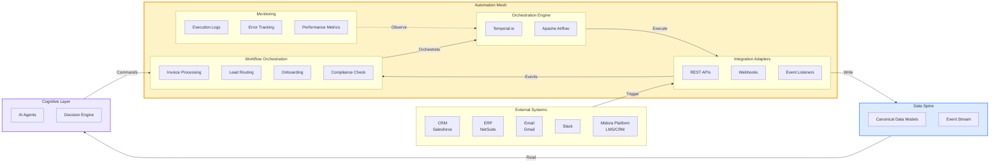
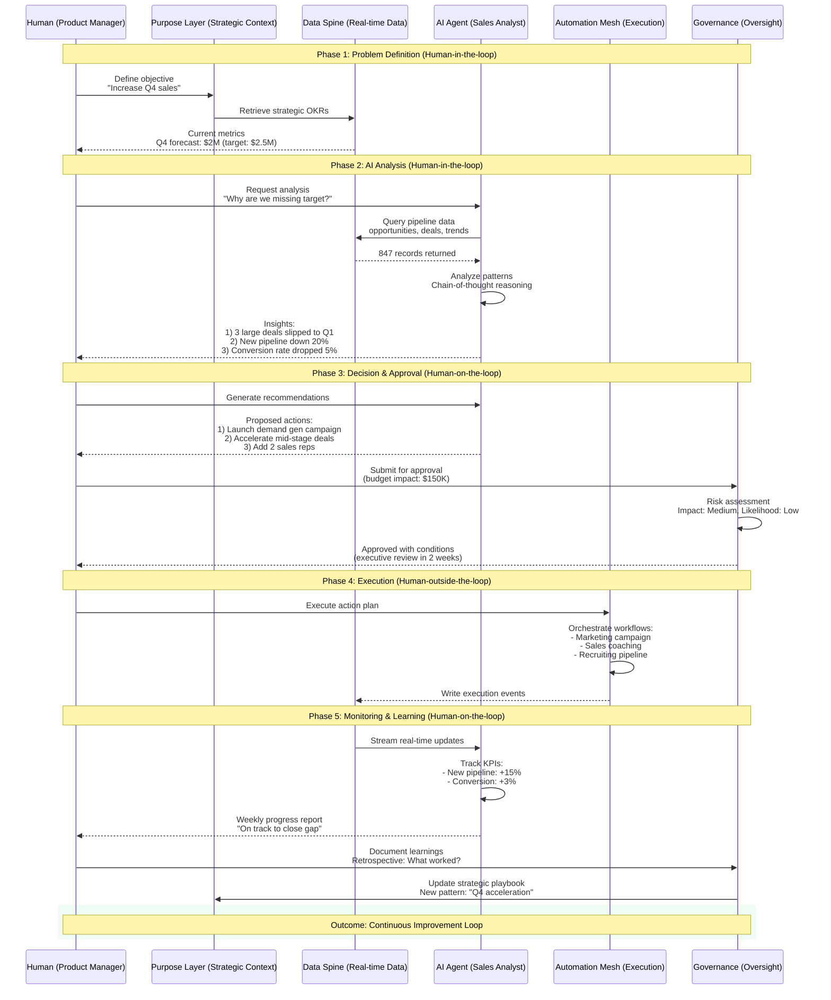

# Whitepaper Diagrams

This page contains the core architectural diagrams for the SOLID.AI framework.

!!! note "Layer Nomenclature"
    The **six-layer architecture** shown here is the operational stack of SOLID.AI — the layers that directly execute work. In some governance contexts, you may see reference to an "8-layer model" that separates Governance into sub-layers (e.g., RFC Process, Compliance, Audit) or splits Purpose into Strategy and Ethics. For this whitepaper, we use the six-layer operational view for clarity and practical implementation.

---

## 1. SOLID.AI Architecture Layer Model

The six-layer architecture forms the organizational nervous system:

```mermaid
graph TB
    subgraph L6["Layer 6: Governance & Ethics"]
        G1[RFC Process]
        G2[Ethical Review]
        G3[Compliance Monitoring]
        G4[Audit Trail]
    end
    
    subgraph L5["Layer 5: Organizational Layer"]
        O1[Squads<br/>5-9 people]
        O2[Pools<br/>Specialists]
        O3[Operations<br/>Stable processes]
    end
    
    subgraph L4["Layer 4: Automation Mesh"]
        A1[SIPOC Workflows]
        A2[Process Orchestration]
        A3[Integration Adapters]
        A4[Monitoring]
    end
    
    subgraph L3["Layer 3: Cognitive Layer"]
        C1[AI Agents]
        C2[Reasoning Engines]
        C3[Context Management]
        C4[Decision Logs]
    end
    
    subgraph L2["Layer 2: Data Spine"]
        D1[Canonical Models]
        D2[Data Contracts]
        D3[Event Streaming]
        D4[Quality Framework]
    end
    
    subgraph L1["Layer 1: Purpose Layer"]
        P1[Mission & Vision]
        P2[Core Values]
        P3[Strategic OKRs]
        P4[Ethical Boundaries]
    end
    
    L6 --> L5
    L5 --> L4
    L4 --> L3
    L3 --> L2
    L2 --> L1
    
    L1 -.->|Informs| L2
    L2 -.->|Powers| L3
    L3 -.->|Executes| L4
    L4 -.->|Organizes| L5
    L5 -.->|Overseen by| L6
    
    style L6 fill:#e8f4f8,stroke:#0d9488,stroke-width:2px
    style L5 fill:#f0fdf4,stroke:#10b981,stroke-width:2px
    style L4 fill:#fef3c7,stroke:#f59e0b,stroke-width:2px
    style L3 fill:#ede9fe,stroke:#8b5cf6,stroke-width:2px
    style L2 fill:#dbeafe,stroke:#3b82f6,stroke-width:2px
    style L1 fill:#fee2e2,stroke:#ef4444,stroke-width:2px
```

**Description:** The six-layer architecture creates an organizational nervous system. The Purpose Layer (DNA) defines immutable identity. The Data Spine (sensory nerves) provides real-time information. The Cognitive Layer (brain) generates insights. The Automation Mesh (motor neurons) executes processes. The Organizational Layer (motor cortex) coordinates human teams. The Governance Layer (prefrontal cortex) ensures ethical oversight.

**Reference Implementation:** See [Midora Topology (ADR-0003)](../../ADR/adr-0003-data-spine-automation-mesh-integration.md) for a concrete mapping of this diagram into a real AI-native education platform.

---

## 2. SOLID.AI Automation Mesh

Process execution layer translating decisions into coordinated actions:

**Description:** The Automation Mesh connects external systems (CRM, ERP, Email, Slack, Midora Platform) through integration adapters, orchestrates workflows using engines like Temporal.io, writes to the Data Spine for single source of truth, receives commands from the Cognitive Layer (AI Agents), and maintains comprehensive monitoring for observability.

**Reference Implementation:** See [Midora Topology (ADR-0003)](../../ADR/adr-0003-data-spine-automation-mesh-integration.md) for a concrete mapping of this diagram into a real AI-native education platform.

---

## 3. SOLID.AI Data Spine Topology

Single source of truth connecting all systems in real-time:

```mermaid
graph TB
    subgraph Sources["Data Sources"]
        S1[CRM<br/>Customers]
        S2[ERP<br/>Finance]
        S3[Support<br/>Tickets]
        S4[Product<br/>Usage]
        S5[HR<br/>Employees]
    end
    
    subgraph Spine["Data Spine Core"]
        subgraph Ingestion["Ingestion Layer"]
            I1[Change Data Capture]
            I2[API Polling]
            I3[Webhook Receivers]
        end
        
        subgraph Stream["Event Streaming"]
            KAFKA[Apache Kafka<br/>Event Bus]
        end
        
        subgraph Models["Canonical Models"]
            M1[Customer Entity]
            M2[Order Entity]
            M3[Ticket Entity]
            M4[Employee Entity]
        end
        
        subgraph Storage["Storage"]
            DB[(PostgreSQL<br/>Canonical Store)]
            WAREHOUSE[(Data Warehouse<br/>Analytics)]
        end
        
        subgraph Quality["Data Quality"]
            Q1[Schema Validation]
            Q2[Business Rules]
            Q3[Completeness Check]
        end
    end
    
    subgraph Consumers["Data Consumers"]
        C1[AI Agents<br/>Cognitive Layer]
        C2[Dashboards<br/>Analytics]
        C3[Workflows<br/>Automation Mesh]
        C4[APIs<br/>External Access]
    end
    
    Sources -->|Raw Data| Ingestion
    Ingestion -->|Events| KAFKA
    KAFKA -->|Stream| Models
    Models -->|Validate| Quality
    Quality -->|Write| DB
    DB -->|Replicate| WAREHOUSE
    DB -->|Read| Consumers
    WAREHOUSE -->|Query| Consumers
    
    style Spine fill:#dbeafe,stroke:#3b82f6,stroke-width:3px
    style Stream fill:#e0f2fe,stroke:#0284c7,stroke-width:2px
    style Models fill:#ddd6fe,stroke:#7c3aed,stroke-width:2px
```

**Description:** The Data Spine ingests data from multiple sources (CRM, ERP, Support, Product, HR) via CDC/APIs/webhooks, streams events through Kafka, maps to canonical entity models, validates quality, stores in PostgreSQL (transactional) and Data Warehouse (analytics), and serves all consumers with <5 second latency and 99.9% uptime SLA.

**Target SLO:** P95 latency < 5s, availability ≥ 99.9%, data freshness < 60s for real-time entities.

**Reference Implementation:** See [Midora Topology (ADR-0003)](../../ADR/adr-0003-data-spine-automation-mesh-integration.md) for a concrete mapping of this diagram into a real AI-native education platform.

---

## 4. SOLID.AI Human-AI Collaboration Loop

Continuous feedback loop between humans and AI agents:

**Description:** The Human-AI Collaboration Loop demonstrates the complete decision cycle across three responsible AI control modes:

- **Human-in-the-loop** (Phases 1-2): Human defines problems and validates AI analysis in real-time
- **Human-on-the-loop** (Phases 3, 5): Human provides oversight and approval gates for AI recommendations and monitoring
- **Human-outside-the-loop** (Phase 4): AI executes approved workflows autonomously with audit trails

This creates a self-improving organizational system where humans provide judgment and AI provides speed/scale, aligned with responsible AI frameworks (IEEE P7001, ISO/IEC 42001).

**Reference Implementation:** See [Midora Topology (ADR-0003)](../../ADR/adr-0003-data-spine-automation-mesh-integration.md) for a concrete mapping of this diagram into a real AI-native education platform.

---

## Diagram Usage Guidelines

### In Academic Citations

When referencing these diagrams in papers:

> "Figure 1 shows the SOLID.AI six-layer architecture (Freitas, 2025), where each layer serves a distinct biological function in the organizational nervous system."

### In Implementation

These diagrams should be used during:
- **Executive presentations** - Use Layer Model to explain transformation scope
- **Technical architecture reviews** - Reference Data Spine and Automation Mesh for infrastructure design
- **Team onboarding** - Show Human-AI Collaboration Loop to clarify roles
- **Vendor evaluations** - Map vendor capabilities to specific layers

### Diagram Formats

All diagrams are available in multiple formats:

- **Mermaid (source)** - Editable, version-controlled `.mmd` files
- **SVG (web)** - Rendered automatically in browser, scalable for presentations
- **PNG (print)** - High-resolution exports for documentation and papers
- **PDF (publication)** - Vector format for academic submissions

---

**Navigation:** [← Governance](governance.md) | [Abstract →](abstract.md)
