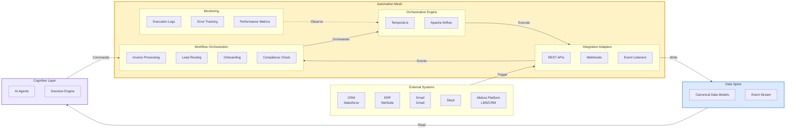
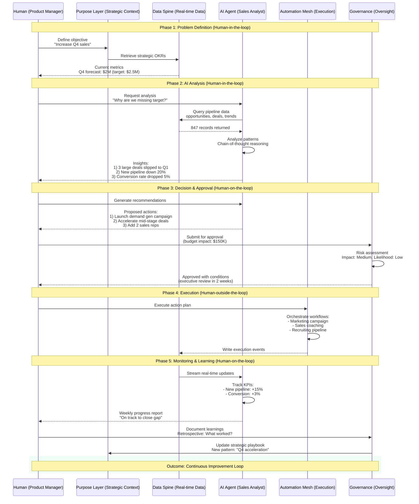

# Architecture Overview

**Status:**  **Version:** 1.0

---

This page presents the complete SOLID.AI architecture through four integrated diagrams. Each figure builds upon the previous, creating a comprehensive view of how AI-native organizations operate.

---

## Figure 1 — SOLID.AI Six-Layer Architecture

Overview of the structural layers from alignment to governance, establishing the foundation for hybrid intelligent organizations.

```mermaid
graph TB
    subgraph L6["Layer 6: Governance & Ethics"]
        G1[RFC Process]
        G2[Ethical Review]
        G3[Compliance Monitoring]
        G4[Audit Trail]
    end
    
    subgraph L5["Layer 5: Organizational Layer"]
        O1[Squads<br/>5-9 people]
        O2[Pools<br/>Specialists]
        O3[Operations<br/>Stable processes]
    end
    
    subgraph L4["Layer 4: Automation Mesh"]
        A1[SIPOC Workflows]
        A2[Process Orchestration]
        A3[Integration Adapters]
        A4[Monitoring]
    end
    
    subgraph L3["Layer 3: Cognitive Layer"]
        C1[AI Agents]
        C2[Reasoning Engines]
        C3[Context Management]
        C4[Decision Logs]
    end
    
    subgraph L2["Layer 2: Data Spine"]
        D1[Canonical Models]
        D2[Data Contracts]
        D3[Event Streaming]
        D4[Quality Framework]
    end
    
    subgraph L1["Layer 1: Purpose Layer"]
        P1[Mission & Vision]
        P2[Core Values]
        P3[Strategic OKRs]
        P4[Ethical Boundaries]
    end
    
    L6 --> L5
    L5 --> L4
    L4 --> L3
    L3 --> L2
    L2 --> L1
    
    L1 -.->|Informs| L2
    L2 -.->|Powers| L3
    L3 -.->|Executes| L4
    L4 -.->|Organizes| L5
    L5 -.->|Overseen by| L6
    
    style L6 fill:#e8f4f8,stroke:#0d9488,stroke-width:2px
    style L5 fill:#f0fdf4,stroke:#10b981,stroke-width:2px
    style L4 fill:#fef3c7,stroke:#f59e0b,stroke-width:2px
    style L3 fill:#ede9fe,stroke:#8b5cf6,stroke-width:2px
    style L2 fill:#dbeafe,stroke:#3b82f6,stroke-width:2px
    style L1 fill:#fee2e2,stroke:#ef4444,stroke-width:2px
```

<figure markdown>
  <figcaption><strong>Figure 1 — SOLID.AI Six-Layer Architecture</strong> 
  The six-layer architecture creates an organizational nervous system where the Purpose Layer (DNA) defines immutable identity, the Data Spine (sensory nerves) provides real-time information, the Cognitive Layer (brain) generates insights, the Automation Mesh (motor neurons) executes processes, the Organizational Layer (motor cortex) coordinates human teams, and the Governance Layer (prefrontal cortex) ensures ethical oversight.</figcaption>
</figure>

**Key Insight:** Each layer serves a distinct biological function, creating a self-regulating system where strategy flows downward (command) and information flows upward (feedback).

---

## Figure 2 — Automation Mesh Reference Model

Event-driven orchestration fabric connecting AI agents, business services, rule engines, and external systems under compliance boundaries.

<figure markdown>
  <figcaption><strong>Figure 2 — Automation Mesh Reference Model</strong> 
  The Automation Mesh connects external systems (CRM, ERP, Email, Slack, Midora Platform) through integration adapters, orchestrates workflows using engines like Temporal.io, writes to the Data Spine for single source of truth, receives commands from the Cognitive Layer (AI Agents), and maintains comprehensive monitoring for observability.</figcaption>
</figure>

**Key Insight:** The Automation Mesh acts as the organization's motor nervous system, translating cognitive decisions into coordinated multi-system actions with full auditability.

---

## Figure 3 — Data Spine Domain Model

Unified data backbone enabling clean, derived, and real-time data flows across the organization.

```mermaid
graph TB
    subgraph Sources["Data Sources"]
        S1[CRM<br/>Customers]
        S2[ERP<br/>Finance]
        S3[Support<br/>Tickets]
        S4[Product<br/>Usage]
        S5[HR<br/>Employees]
    end
    
    subgraph Spine["Data Spine Core"]
        subgraph Ingestion["Ingestion Layer"]
            I1[Change Data Capture]
            I2[API Polling]
            I3[Webhook Receivers]
        end
        
        subgraph Stream["Event Streaming"]
            KAFKA[Apache Kafka<br/>Event Bus]
        end
        
        subgraph Models["Canonical Models"]
            M1[Customer Entity]
            M2[Order Entity]
            M3[Ticket Entity]
            M4[Employee Entity]
        end
        
        subgraph Storage["Storage"]
            DB[(PostgreSQL<br/>Canonical Store)]
            WAREHOUSE[(Data Warehouse<br/>Analytics)]
        end
        
        subgraph Quality["Data Quality"]
            Q1[Schema Validation]
            Q2[Business Rules]
            Q3[Completeness Check]
        end
    end
    
    subgraph Consumers["Data Consumers"]
        C1[AI Agents<br/>Cognitive Layer]
        C2[Dashboards<br/>Analytics]
        C3[Workflows<br/>Automation Mesh]
        C4[APIs<br/>External Access]
    end
    
    Sources -->|Raw Data| Ingestion
    Ingestion -->|Events| KAFKA
    KAFKA -->|Stream| Models
    Models -->|Validate| Quality
    Quality -->|Write| DB
    DB -->|Replicate| WAREHOUSE
    DB -->|Read| Consumers
    WAREHOUSE -->|Query| Consumers
    
    style Spine fill:#dbeafe,stroke:#3b82f6,stroke-width:3px
    style Stream fill:#e0f2fe,stroke:#0284c7,stroke-width:2px
    style Models fill:#ddd6fe,stroke:#7c3aed,stroke-width:2px
```

<figure markdown>
  <figcaption><strong>Figure 3 — Data Spine Domain Model</strong> 
  The Data Spine ingests data from multiple sources (CRM, ERP, Support, Product, HR) via CDC/APIs/webhooks, streams events through Kafka, maps to canonical entity models, validates quality, stores in PostgreSQL (transactional) and Data Warehouse (analytics), and serves all consumers with &lt;5 second latency and 99.9% uptime SLA. <strong>Target SLO:</strong> P95 latency &lt; 5s, availability ≥ 99.9%, data freshness &lt; 60s for real-time entities.</figcaption>
</figure>

**Key Insight:** The Data Spine eliminates data silos by providing a single, real-time, canonical view of organizational truth, accessible to both humans and AI agents through unified interfaces.

---

## Figure 4 — Human-AI Collaboration Loop

End-to-end sequence of analysis, recommendation, decision, execution, and learning in hybrid intelligent teams.

<figure markdown>
  <figcaption><strong>Figure 4 — Human-AI Collaboration Loop</strong> 
  The Human-AI Collaboration Loop demonstrates the complete decision cycle across three responsible AI control modes: <strong>Human-in-the-loop</strong> (Phases 1-2) where humans define problems and validate AI analysis in real-time; <strong>Human-on-the-loop</strong> (Phases 3, 5) where humans provide oversight and approval gates for AI recommendations and monitoring; and <strong>Human-outside-the-loop</strong> (Phase 4) where AI executes approved workflows autonomously with audit trails. This creates a self-improving organizational system where humans provide judgment and AI provides speed/scale, aligned with responsible AI frameworks (IEEE P7001, ISO/IEC 42001).</figcaption>
</figure>

**Key Insight:** The collaboration loop embeds humans at strategic control points while allowing AI to operate autonomously within approved boundaries, creating both speed and safety.

---

## System Integration

These four figures form an integrated architectural view:

1. **Figure 1** establishes the **structural foundation** — six layers creating an organizational nervous system
2. **Figure 2** details the **execution layer** — how workflows orchestrate across systems
3. **Figure 3** reveals the **information backbone** — canonical data flowing in real-time
4. **Figure 4** demonstrates the **operational cycle** — humans and AI collaborating through defined control modes

**Together**, they specify a complete AI-native organization where:

- **Strategy flows down** (Purpose → Data → Cognitive → Automation → Organization → Governance)
- **Feedback flows up** (Execution results inform strategic adjustments)
- **Humans and AI collaborate** at appropriate control points (in-the-loop, on-the-loop, outside-the-loop)
- **All actions are auditable** through immutable event logs and decision trails

---

## Reference Implementation

The [Midora Platform](https://midora.ai) provides a concrete implementation of this architecture in the education technology domain, demonstrating:

- **Data Spine:** Unified student, course, and engagement data across LMS, CRM, and content systems
- **Cognitive Layer:** AI tutors, curriculum designers, and administrative assistants
- **Automation Mesh:** Enrollment workflows, content generation pipelines, assessment orchestration
- **Governance:** Ethical AI review for student-facing agents, FERPA compliance monitoring

**See:** [ADR-0003: Data Spine & Automation Mesh Integration](../adr/adr-0003-data-spine-automation-mesh-integration.md) for detailed technical specifications.

---

## Use Cases

This architecture overview is designed for:

| Audience | Use Case | Focus Figures |
|----------|----------|---------------|
| **Executives** | Business transformation roadmap | Figure 1, 4 |
| **Architects** | System design and integration | Figure 2, 3 |
| **Data Engineers** | Data infrastructure planning | Figure 3 |
| **AI Engineers** | Agent deployment and orchestration | Figure 2, 4 |
| **Product Managers** | Feature prioritization and workflows | Figure 1, 2, 4 |
| **Compliance Officers** | Governance and audit requirements | Figure 1, 4 |

---

## PDF Export

For high-resolution PDF exports suitable for presentations and publications:

1. Use browser print function (Ctrl/Cmd + P)
2. Select "Save as PDF"
3. Enable "Background graphics"
4. Set scale to 100%
5. Margins: Minimum

Alternatively, use specialized Mermaid PDF exporters:
- [Mermaid CLI](https://github.com/mermaid-js/mermaid-cli)
- [mmdc command-line tool](https://www.npmjs.com/package/@mermaid-js/mermaid-cli)

---

**Navigation:** [← Diagrams](diagrams.md) | [Abstract →](abstract.md) | [Index](index.md)
